# Technical Functionality Documentation
## Complete Asset Lifecycle Management System


**Version:** 1.0.0 
**Last Updated:** 2024 
**Document Type:** Technical Specification & User Guide


---


## Table of Contents


1. [System Overview](#1-system-overview)
2. [Architecture Overview](#2-architecture-overview)
3. [Auth-Service Detailed Functionality](#3-auth-service-detailed-functionality)
4. [Asset-Service Detailed Functionality](#4-asset-service-detailed-functionality)
5. [Notification-Service Detailed Functionality](#5-notification-service-detailed-functionality)
6. [Integration Flows](#6-integration-flows)
7. [API Reference](#7-api-reference)
8. [Use Cases & Scenarios](#8-use-cases--scenarios)
9. [Technical Specifications](#9-technical-specifications)
10. [Error Handling & Troubleshooting](#10-error-handling--troubleshooting)


---


## 1. System Overview


### 1.1 Purpose


The Complete Asset Lifecycle Management System is a microservices-based platform designed to manage the entire lifecycle of assets from procurement to disposal. The system provides:


- **User Authentication & Authorization** - Multiple authentication methods
- **Asset Management** - Complete CRUD operations for assets
- **Master Data Management** - Categories, Makes, Models, Vendors, etc.
- **Compliance & Validation** - Rule-based compliance checking
- **Document Management** - Asset-related document storage
- **Warranty & AMC Management** - Track warranties and maintenance contracts
- **User-Asset Linking** - Assign assets to users
- **Notification System** - Multi-channel notifications (SMS, Email, WhatsApp, In-App)


### 1.2 System Components


```
┌─────────────────────────────────────────────────────────────┐
│                    CLIENT APPLICATIONS                        │
│              (Web Frontend / Mobile App)                      │
└─────────────────────────────────────────────────────────────┘
                           │
                           │ HTTP/REST API
                           │ JWT Token Authentication
                           ▼
┌─────────────────────────────────────────────────────────────┐
│                    MICROSERVICES LAYER                       │
│  ┌──────────────┐  ┌──────────────┐  ┌──────────────┐      │
│  │ Auth-Service │  │Asset-Service │  │Notification- │      │
│  │  Port: 6001  │  │  Port: 6003  │  │   Service    │      │
│  │              │  │              │  │  Port: 6002   │      │
│  └──────────────┘  └──────────────┘  └──────────────┘      │
└─────────────────────────────────────────────────────────────┘
                           │
                           │ JPA/Hibernate
                           ▼
┌─────────────────────────────────────────────────────────────┐
│                      DATABASE LAYER                          │
│  ┌──────────────┐  ┌──────────────┐  ┌──────────────┐      │
│  │   authdb     │  │   assetdb    │  │notificationdb│      │
│  │              │  │              │  │              │      │
│  └──────────────┘  └──────────────┘  └──────────────┘      │
└─────────────────────────────────────────────────────────────┘
```


### 1.3 Key Features


- ✅ **Multi-Authentication Methods**: Password, OTP, MPIN, RSA, WebAuthn/Passkey
- ✅ **JWT Token-Based Security**: Stateless authentication across services
- ✅ **Comprehensive Asset Management**: Full lifecycle from creation to disposal
- ✅ **Master Data Management**: Hierarchical categories, makes, models
- ✅ **Compliance Engine**: Rule-based validation and compliance checking
- ✅ **Document Management**: File upload, storage, and retrieval
- ✅ **Warranty & AMC Tracking**: Automated tracking of warranties and contracts
- ✅ **User-Asset Assignment**: Flexible linking of assets to users
- ✅ **Multi-Channel Notifications**: SMS, Email, WhatsApp, In-App
- ✅ **Bulk Operations**: Excel import/export for bulk data management
- ✅ **Audit Logging**: Complete audit trail for all operations


---


## 2. Architecture Overview


### 2.1 Microservices Architecture


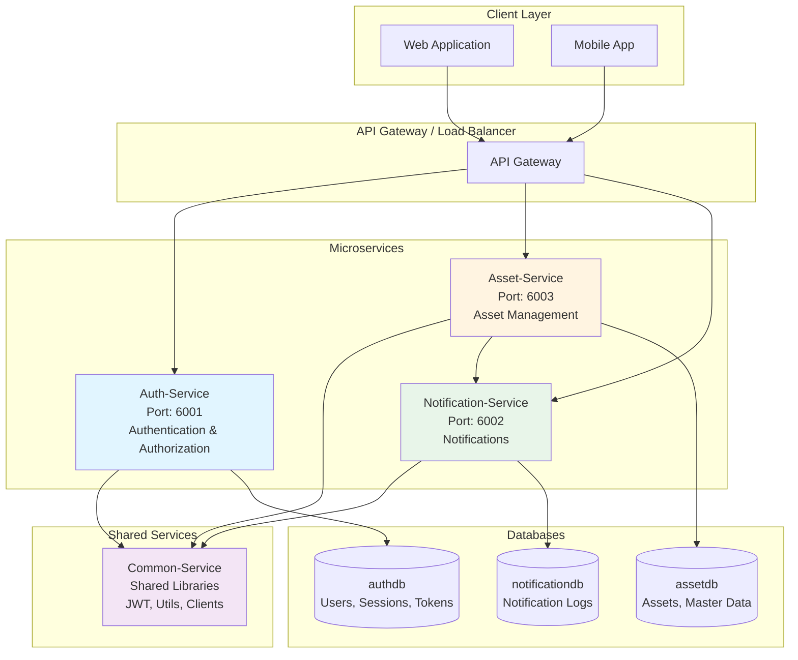
```mermaid
graph TB
   subgraph "Client Layer"
       Web[Web Application]
       Mobile[Mobile App]
   end


   subgraph "API Gateway / Load Balancer"
       Gateway[API Gateway]
   end


   subgraph "Microservices"
       Auth[Auth-Service<br/>Port: 6001<br/>Authentication & Authorization]
       Asset[Asset-Service<br/>Port: 6003<br/>Asset Management]
       Notif[Notification-Service<br/>Port: 6002<br/>Notifications]
   end


   subgraph "Shared Services"
       Common[Common-Service<br/>Shared Libraries<br/>JWT, Utils, Clients]
   end


   subgraph "Databases"
       AuthDB[(authdb<br/>Users, Sessions, Tokens)]
       AssetDB[(assetdb<br/>Assets, Master Data)]
       NotifDB[(notificationdb<br/>Notification Logs)]
   end


   Web --> Gateway
   Mobile --> Gateway
   Gateway --> Auth
   Gateway --> Asset
   Gateway --> Notif
  
   Auth --> Common
   Asset --> Common
   Notif --> Common
  
   Asset --> Notif
  
   Auth --> AuthDB
   Asset --> AssetDB
   Notif --> NotifDB


   style Auth fill:#e1f5ff
   style Asset fill:#fff4e1
   style Notif fill:#e8f5e9
   style Common fill:#f3e5f5
```


### 2.2 Technology Stack


| Component | Technology |
|-----------|-----------|
| **Language** | Java 17+ |
| **Framework** | Spring Boot 3.x |
| **Database** | MySQL 8.0 |
| **ORM** | JPA/Hibernate |
| **Security** | Spring Security, JWT |
| **API Documentation** | OpenAPI/Swagger |
| **Inter-Service Communication** | REST, Feign Client |
| **Build Tool** | Maven |
| **Container** | Docker (optional) |


---


## 3. Auth-Service Detailed Functionality


### 3.1 Overview


The Auth-Service is responsible for user authentication, authorization, and session management. It provides multiple authentication methods and generates JWT tokens for secure access to other services.


**Base URL:** `http://13.127.199.97:6001` 
**Port:** 6001 
**Database:** `authdb`


### 3.2 Core Features


1. **User Registration** - Standard and admin user registration
2. **Multiple Authentication Methods** - 6 different login methods
3. **Token Management** - JWT access and refresh tokens
4. **Session Management** - User session tracking
5. **Credential Management** - RSA, WebAuthn, MPIN support
6. **OTP Generation** - One-time password for login/verification
7. **User Profile Management** - User details and profile updates
8. **Audit Logging** - Complete audit trail


### 3.3 Authentication Methods


#### 3.3.1 Password Authentication


**Flow Diagram:**


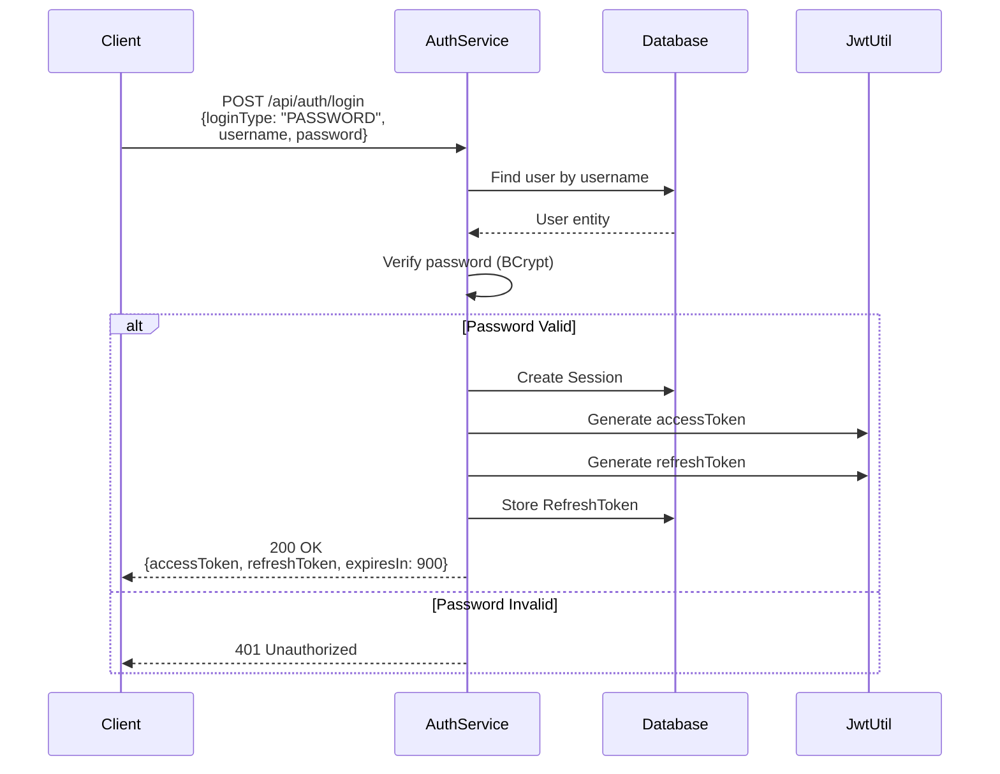
```mermaid
sequenceDiagram
   participant Client
   participant AuthService
   participant Database
   participant JwtUtil


   Client->>AuthService: POST /api/auth/login<br/>{loginType: "PASSWORD",<br/>username, password}
   AuthService->>Database: Find user by username
   Database-->>AuthService: User entity
   AuthService->>AuthService: Verify password (BCrypt)
   alt Password Valid
       AuthService->>Database: Create Session
       AuthService->>JwtUtil: Generate accessToken
       AuthService->>JwtUtil: Generate refreshToken
       AuthService->>Database: Store RefreshToken
       AuthService-->>Client: 200 OK<br/>{accessToken, refreshToken, expiresIn: 900}
   else Password Invalid
       AuthService-->>Client: 401 Unauthorized
   end
```


**Request Example:**
```json
POST /api/auth/login
{
 "loginType": "PASSWORD",
 "username": "user@example.com",
 "password": "SecurePassword123",
 "deviceInfo": "iPhone 14 Pro"
}
```


**Response Example:**
```json
{
 "accessToken": "eyJhbGciOiJSUzI1NiIsInR5cCI6IkpXVCJ9...",
 "refreshToken": "550e8400-e29b-41d4-a716-446655440000",
 "expiresIn": 900
}
```


#### 3.3.2 OTP Authentication


**Flow Diagram:**


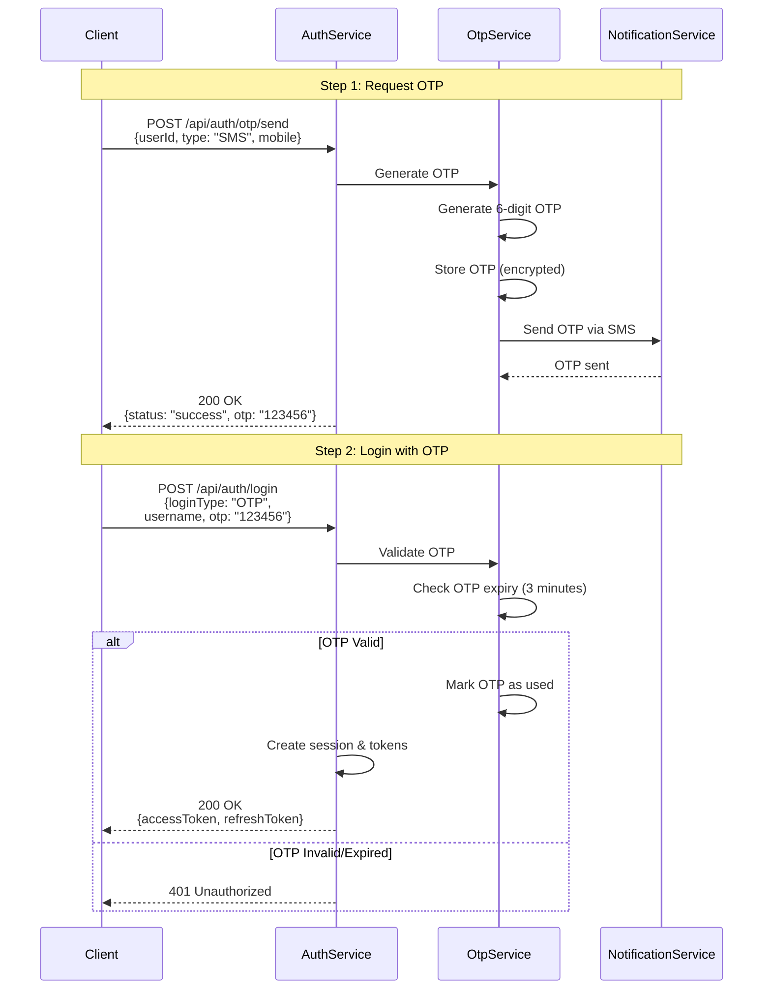
```mermaid
sequenceDiagram
   participant Client
   participant AuthService
   participant OtpService
   participant NotificationService


   Note over Client,NotificationService: Step 1: Request OTP
   Client->>AuthService: POST /api/auth/otp/send<br/>{userId, type: "SMS", mobile}
   AuthService->>OtpService: Generate OTP
   OtpService->>OtpService: Generate 6-digit OTP
   OtpService->>OtpService: Store OTP (encrypted)
   OtpService->>NotificationService: Send OTP via SMS
   NotificationService-->>OtpService: OTP sent
   AuthService-->>Client: 200 OK<br/>{status: "success", otp: "123456"}


   Note over Client,NotificationService: Step 2: Login with OTP
   Client->>AuthService: POST /api/auth/login<br/>{loginType: "OTP",<br/>username, otp: "123456"}
   AuthService->>OtpService: Validate OTP
   OtpService->>OtpService: Check OTP expiry (3 minutes)
   alt OTP Valid
       OtpService->>OtpService: Mark OTP as used
       AuthService->>AuthService: Create session & tokens
       AuthService-->>Client: 200 OK<br/>{accessToken, refreshToken}
   else OTP Invalid/Expired
       AuthService-->>Client: 401 Unauthorized
   end
```


#### 3.3.3 MPIN Authentication


**Flow Diagram:**


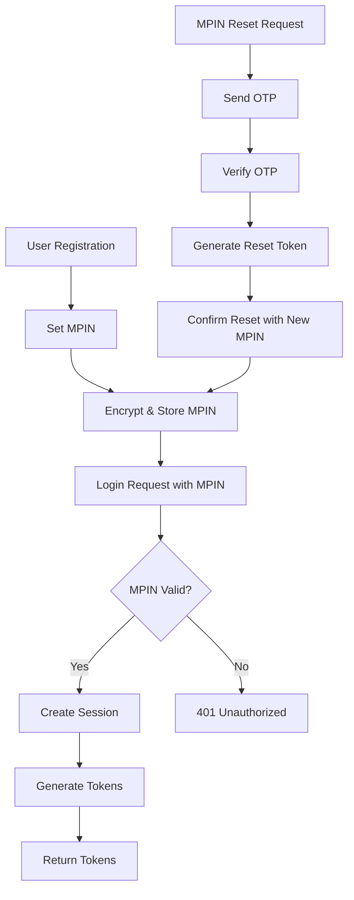
```mermaid
flowchart TD
   A[User Registration] --> B[Set MPIN]
   B --> C[Encrypt & Store MPIN]
   C --> D[Login Request with MPIN]
   D --> E{MPIN Valid?}
   E -->|Yes| F[Create Session]
   E -->|No| G[401 Unauthorized]
   F --> H[Generate Tokens]
   H --> I[Return Tokens]
  
   J[MPIN Reset Request] --> K[Send OTP]
   K --> L[Verify OTP]
   L --> M[Generate Reset Token]
   M --> N[Confirm Reset with New MPIN]
   N --> C
```


**Endpoints:**
- `POST /api/auth/mpin/register` - Register MPIN
- `POST /api/auth/mpin/verify` - Login with MPIN
- `POST /api/auth/mpin/reset/request` - Request MPIN reset
- `POST /api/auth/mpin/reset/confirm` - Confirm MPIN reset


#### 3.3.4 RSA Signature Authentication


**Flow Diagram:**


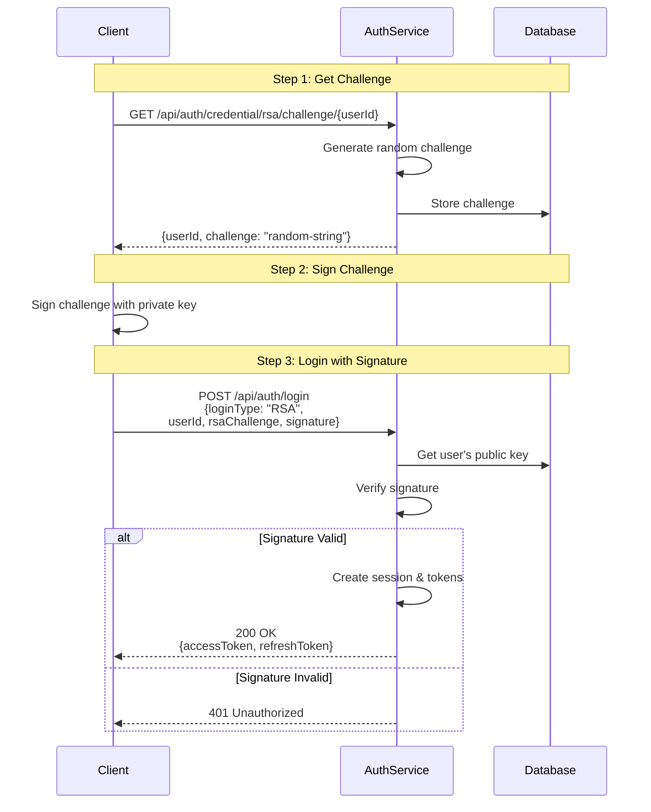
```mermaid
sequenceDiagram
   participant Client
   participant AuthService
   participant Database


   Note over Client,Database: Step 1: Get Challenge
   Client->>AuthService: GET /api/auth/credential/rsa/challenge/{userId}
   AuthService->>AuthService: Generate random challenge
   AuthService->>Database: Store challenge
   AuthService-->>Client: {userId, challenge: "random-string"}


   Note over Client,Database: Step 2: Sign Challenge
   Client->>Client: Sign challenge with private key


   Note over Client,Database: Step 3: Login with Signature
   Client->>AuthService: POST /api/auth/login<br/>{loginType: "RSA",<br/>userId, rsaChallenge, signature}
   AuthService->>Database: Get user's public key
   AuthService->>AuthService: Verify signature
   alt Signature Valid
       AuthService->>AuthService: Create session & tokens
       AuthService-->>Client: 200 OK<br/>{accessToken, refreshToken}
   else Signature Invalid
       AuthService-->>Client: 401 Unauthorized
   end
```


#### 3.3.5 WebAuthn/Passkey Authentication


Similar flow to RSA but uses WebAuthn protocol with credential IDs and signatures.


### 3.4 User Registration Flow


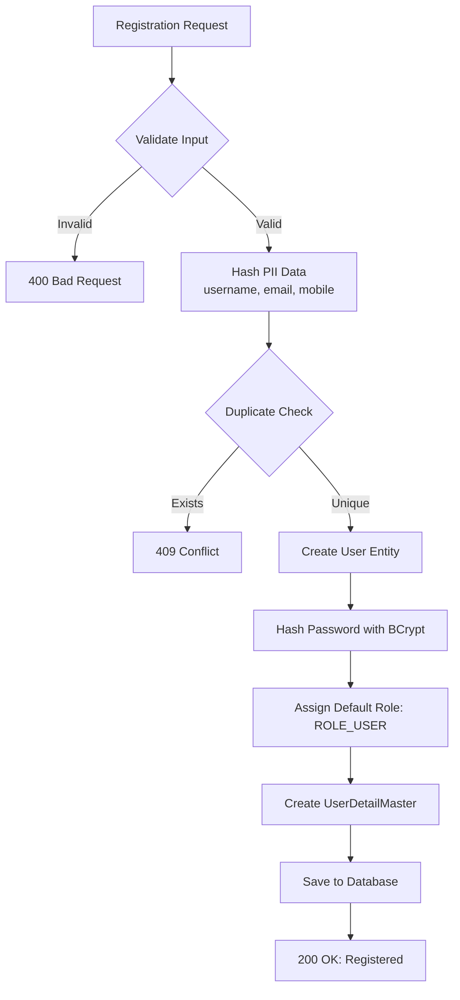
```mermaid
flowchart TD
   A[Registration Request] --> B{Validate Input}
   B -->|Invalid| C[400 Bad Request]
   B -->|Valid| D[Hash PII Data<br/>username, email, mobile]
   D --> E{Duplicate Check}
   E -->|Exists| F[409 Conflict]
   E -->|Unique| G[Create User Entity]
   G --> H[Hash Password with BCrypt]
   H --> I[Assign Default Role: ROLE_USER]
   I --> J[Create UserDetailMaster]
   J --> K[Save to Database]
   K --> L[200 OK: Registered]
```


**Request:**
```json
POST /api/auth/register
{
 "username": "user@example.com",
 "password": "SecurePassword123",
 "email": "user@example.com",
 "mobile": "9876543210",
 "projectType": "ASSET_SERVICE"
}
```


### 3.5 Token Refresh Flow


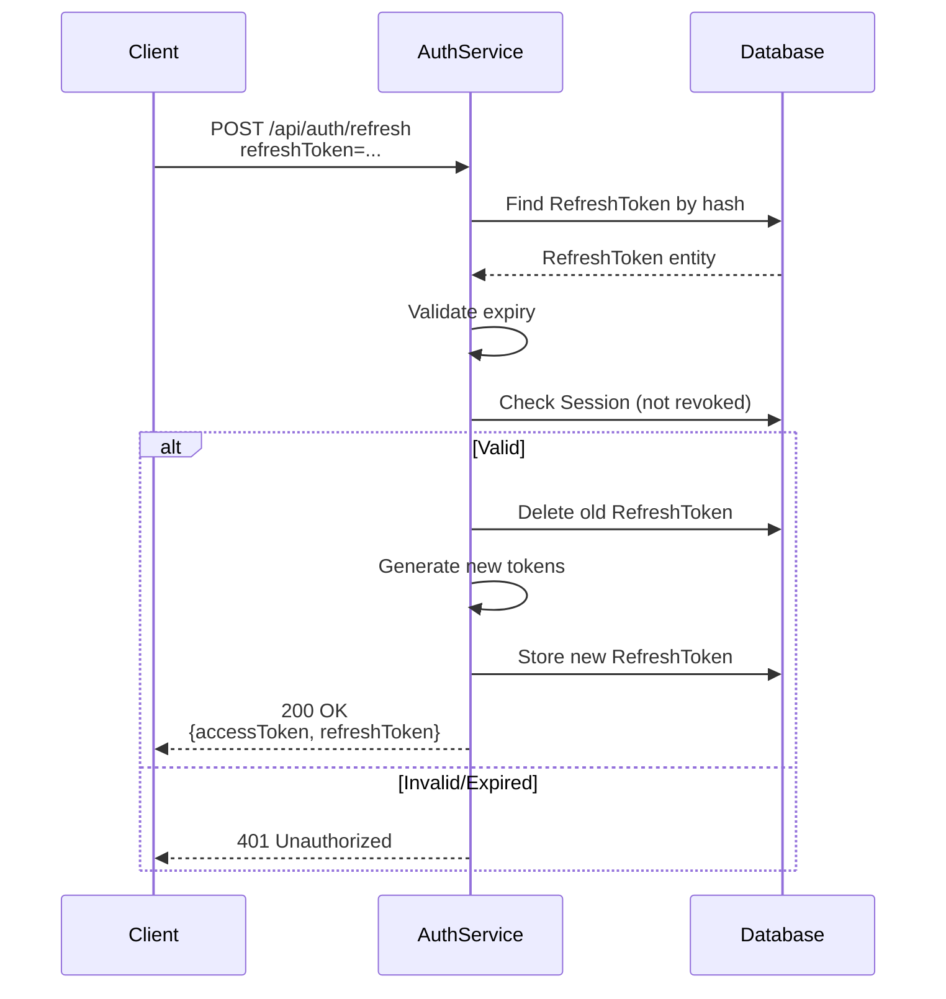
```mermaid
sequenceDiagram
   participant Client
   participant AuthService
   participant Database


   Client->>AuthService: POST /api/auth/refresh<br/>refreshToken=...
   AuthService->>Database: Find RefreshToken by hash
   Database-->>AuthService: RefreshToken entity
   AuthService->>AuthService: Validate expiry
   AuthService->>Database: Check Session (not revoked)
   alt Valid
       AuthService->>Database: Delete old RefreshToken
       AuthService->>AuthService: Generate new tokens
       AuthService->>Database: Store new RefreshToken
       AuthService-->>Client: 200 OK<br/>{accessToken, refreshToken}
   else Invalid/Expired
       AuthService-->>Client: 401 Unauthorized
   end
```


### 3.6 API Endpoints Summary


| Method | Endpoint | Description |
|--------|----------|-------------|
| POST | `/api/auth/register` | Register new user |
| POST | `/api/auth/adminregister` | Register admin user |
| POST | `/api/auth/login` | Login (multiple methods) |
| POST | `/api/auth/refresh` | Refresh access token |
| POST | `/api/auth/otp/send` | Send OTP |
| POST | `/api/auth/mpin/register` | Register MPIN |
| POST | `/api/auth/mpin/verify` | Verify MPIN |
| POST | `/api/auth/mpin/reset/request` | Request MPIN reset |
| POST | `/api/auth/mpin/reset/confirm` | Confirm MPIN reset |
| POST | `/api/auth/credential/register` | Register credential (RSA/WebAuthn) |
| GET | `/api/auth/credential/rsa/challenge/{userId}` | Get RSA challenge |
| GET | `/api/auth/credential/webauthn/challenge/{userId}` | Get WebAuthn challenge |
| POST | `/api/auth/credential/rsa/verify` | Verify RSA signature |
| POST | `/api/auth/credential/webauthn/verify` | Verify WebAuthn response |
| POST | `/api/auth/contact/change/request` | Request email/mobile change |
| POST | `/api/auth/contact/change/confirm` | Confirm email/mobile change |
| GET | `/api/user/me` | Get current user profile |
| GET | `/api/user/{id}` | Get user by ID |


---


## 4. Asset-Service Detailed Functionality


### 4.1 Overview


The Asset-Service manages the complete lifecycle of assets, including creation, updates, deletion, master data management, compliance checking, document management, warranty/AMC tracking, and user-asset linking.


**Base URL:** `http://13.127.199.97:6003` 
**Port:** 6003 
**Database:** `assetdb`


### 4.2 Core Features


1. **Asset CRUD Operations** - Create, Read, Update, Delete assets
2. **Master Data Management** - Categories, SubCategories, Makes, Models, Vendors, Outlets
3. **Component Management** - Asset components tracking
4. **Document Management** - File upload, storage, retrieval
5. **Warranty Management** - Track asset warranties
6. **AMC Management** - Annual Maintenance Contract tracking
7. **User-Asset Linking** - Assign assets to users
8. **Compliance Checking** - Rule-based validation
9. **Bulk Operations** - Excel import/export
10. **Audit Logging** - Complete audit trail


### 4.3 Asset Lifecycle Flow


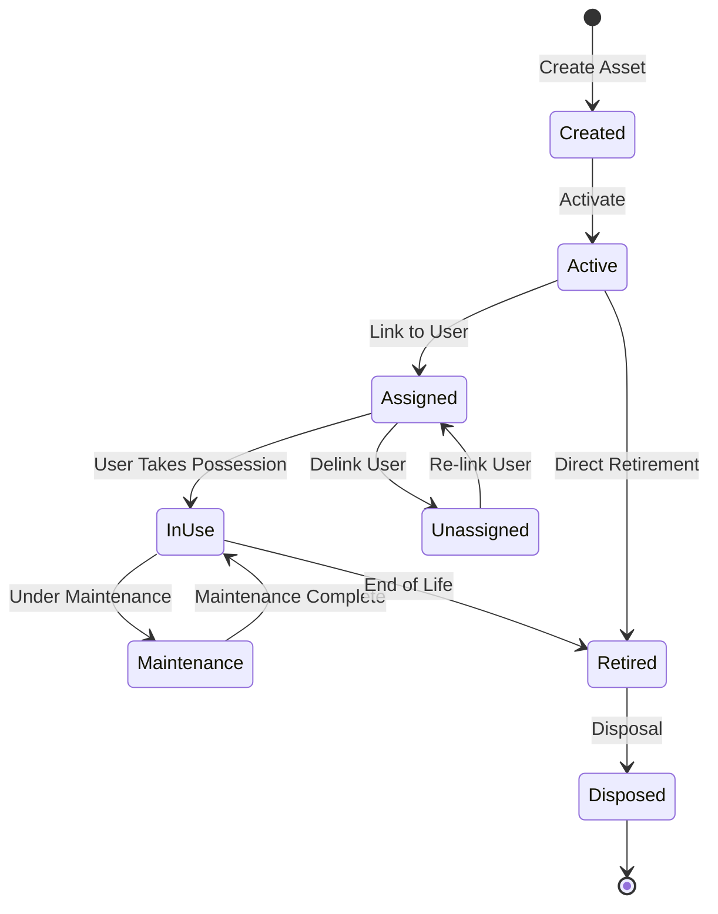
```mermaid
stateDiagram-v2
   [*] --> Created: Create Asset
   Created --> Active: Activate
   Active --> Assigned: Link to User
   Assigned --> InUse: User Takes Possession
   InUse --> Maintenance: Under Maintenance
   Maintenance --> InUse: Maintenance Complete
   InUse --> Retired: End of Life
   Retired --> Disposed: Disposal
   Disposed --> [*]
  
   Active --> Retired: Direct Retirement
   Assigned --> Unassigned: Delink User
   Unassigned --> Assigned: Re-link User
```


### 4.4 Asset Creation Flow


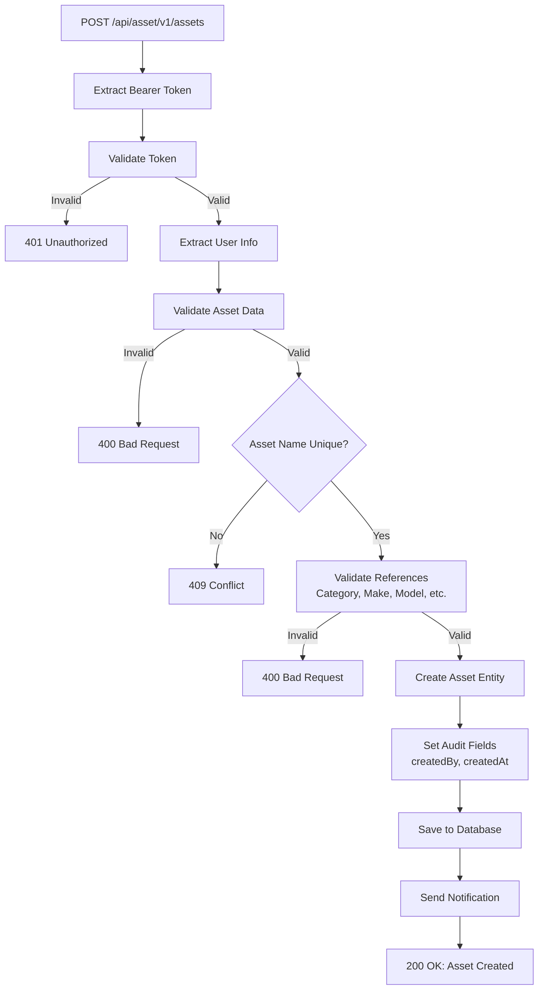
```mermaid
flowchart TD
   A[POST /api/asset/v1/assets] --> B[Extract Bearer Token]
   B --> C[Validate Token]
   C -->|Invalid| D[401 Unauthorized]
   C -->|Valid| E[Extract User Info]
   E --> F[Validate Asset Data]
   F -->|Invalid| G[400 Bad Request]
   F -->|Valid| H{Asset Name Unique?}
   H -->|No| I[409 Conflict]
   H -->|Yes| J[Validate References<br/>Category, Make, Model, etc.]
   J -->|Invalid| K[400 Bad Request]
   J -->|Valid| L[Create Asset Entity]
   L --> M[Set Audit Fields<br/>createdBy, createdAt]
   M --> N[Save to Database]
   N --> O[Send Notification]
   O --> P[200 OK: Asset Created]
```


**Request Example:**
```json
POST /api/asset/v1/assets
Authorization: Bearer <token>
{
 "userId": 123,
 "username": "user@example.com",
 "projectType": "ASSET_SERVICE",
 "asset": {
   "assetNameUdv": "Laptop-DELL-001",
   "category": {
     "categoryId": 1
   },
   "subCategory": {
     "subCategoryId": 2
   },
   "make": {
     "makeId": 3
   },
   "model": {
     "modelId": 4
   },
   "vendor": {
     "vendorId": 5
   },
   "purchaseDate": "2024-01-15",
   "purchasePrice": 50000.00,
   "status": "ACTIVE"
 }
}
```


### 4.5 Master Data Management


#### 4.5.1 Category Hierarchy


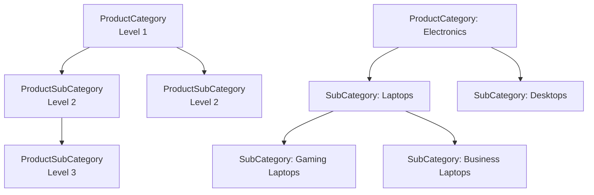
```mermaid
graph TD
   A[ProductCategory<br/>Level 1] --> B[ProductSubCategory<br/>Level 2]
   B --> C[ProductSubCategory<br/>Level 3]
   A --> D[ProductSubCategory<br/>Level 2]
  
   E[ProductCategory: Electronics] --> F[SubCategory: Laptops]
   E --> G[SubCategory: Desktops]
   F --> H[SubCategory: Gaming Laptops]
   F --> I[SubCategory: Business Laptops]
```


**Category Creation Flow:**


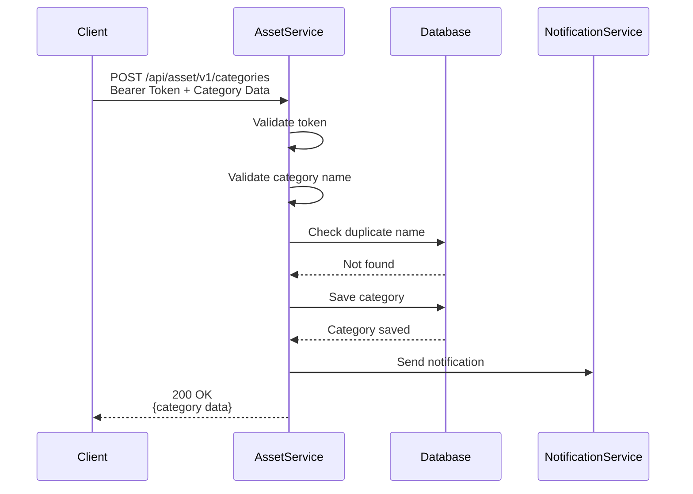
```mermaid
sequenceDiagram
   participant Client
   participant AssetService
   participant Database
   participant NotificationService


   Client->>AssetService: POST /api/asset/v1/categories<br/>Bearer Token + Category Data
   AssetService->>AssetService: Validate token
   AssetService->>AssetService: Validate category name
   AssetService->>Database: Check duplicate name
   Database-->>AssetService: Not found
   AssetService->>Database: Save category
   Database-->>AssetService: Category saved
   AssetService->>NotificationService: Send notification
   AssetService-->>Client: 200 OK<br/>{category data}
```


#### 4.5.2 Make-Model Relationship


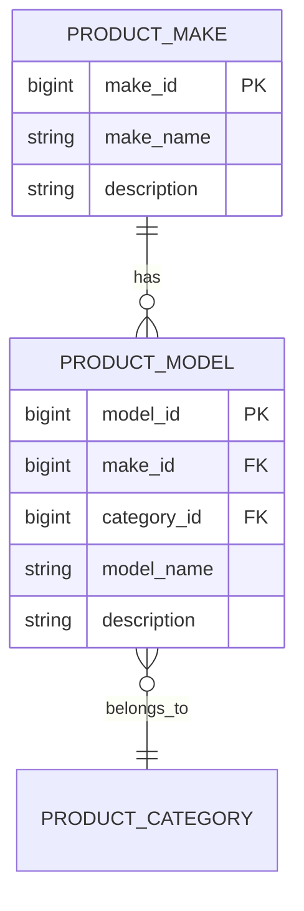
```mermaid
erDiagram
   PRODUCT_MAKE ||--o{ PRODUCT_MODEL : has
   PRODUCT_MODEL }o--|| PRODUCT_CATEGORY : belongs_to
  
   PRODUCT_MAKE {
       bigint make_id PK
       string make_name
       string description
   }
  
   PRODUCT_MODEL {
       bigint model_id PK
       bigint make_id FK
       bigint category_id FK
       string model_name
       string description
   }
```


### 4.6 User-Asset Linking Flow


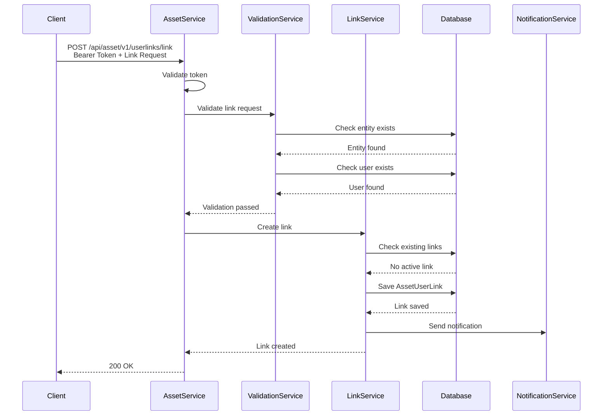
```mermaid
sequenceDiagram
   participant Client
   participant AssetService
   participant ValidationService
   participant LinkService
   participant Database
   participant NotificationService


   Client->>AssetService: POST /api/asset/v1/userlinks/link<br/>Bearer Token + Link Request
   AssetService->>AssetService: Validate token
   AssetService->>ValidationService: Validate link request
   ValidationService->>Database: Check entity exists
   Database-->>ValidationService: Entity found
   ValidationService->>Database: Check user exists
   Database-->>ValidationService: User found
   ValidationService-->>AssetService: Validation passed
   AssetService->>LinkService: Create link
   LinkService->>Database: Check existing links
   Database-->>LinkService: No active link
   LinkService->>Database: Save AssetUserLink
   Database-->>LinkService: Link saved
   LinkService->>NotificationService: Send notification
   LinkService-->>AssetService: Link created
   AssetService-->>Client: 200 OK
```


**Link Request:**
```json
POST /api/asset/v1/userlinks/link
{
 "entityType": "ASSET",
 "entityId": 123,
 "targetUserId": 456,
 "targetUsername": "assignee@example.com",
 "userId": 789,
 "username": "admin@example.com"
}
```


### 4.7 Compliance Checking Flow


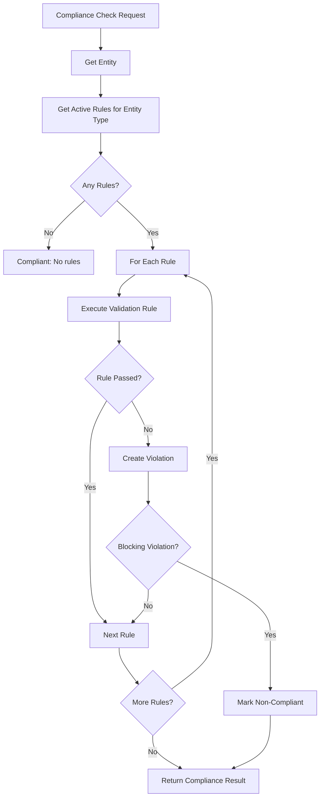
```mermaid
flowchart TD
   A[Compliance Check Request] --> B[Get Entity]
   B --> C[Get Active Rules for Entity Type]
   C --> D{Any Rules?}
   D -->|No| E[Compliant: No rules]
   D -->|Yes| F[For Each Rule]
   F --> G[Execute Validation Rule]
   G --> H{Rule Passed?}
   H -->|Yes| I[Next Rule]
   H -->|No| J[Create Violation]
   J --> K{Blocking Violation?}
   K -->|Yes| L[Mark Non-Compliant]
   K -->|No| I
   I --> M{More Rules?}
   M -->|Yes| F
   M -->|No| N[Return Compliance Result]
   L --> N
```


**Compliance Check Request:**
```json
POST /api/asset/v1/compliance/check
{
 "entityType": "ASSET",
 "entityId": 123
}
```


**Response:**
```json
{
 "compliant": false,
 "entityType": "ASSET",
 "entityId": 123,
 "checkedAt": "2024-01-15T10:30:00",
 "violations": [
   {
     "ruleId": 1,
     "ruleName": "Warranty Required",
     "severity": "BLOCKING",
     "message": "Asset must have warranty information"
   }
 ]
}
```


### 4.8 Document Management Flow


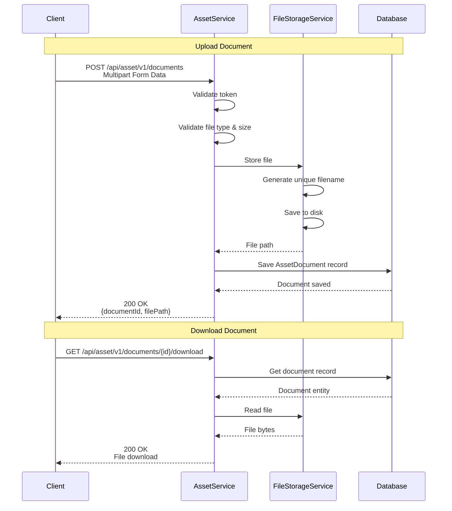
```mermaid
sequenceDiagram
   participant Client
   participant AssetService
   participant FileStorageService
   participant Database


   Note over Client,Database: Upload Document
   Client->>AssetService: POST /api/asset/v1/documents<br/>Multipart Form Data
   AssetService->>AssetService: Validate token
   AssetService->>AssetService: Validate file type & size
   AssetService->>FileStorageService: Store file
   FileStorageService->>FileStorageService: Generate unique filename
   FileStorageService->>FileStorageService: Save to disk
   FileStorageService-->>AssetService: File path
   AssetService->>Database: Save AssetDocument record
   Database-->>AssetService: Document saved
   AssetService-->>Client: 200 OK<br/>{documentId, filePath}


   Note over Client,Database: Download Document
   Client->>AssetService: GET /api/asset/v1/documents/{id}/download
   AssetService->>Database: Get document record
   Database-->>AssetService: Document entity
   AssetService->>FileStorageService: Read file
   FileStorageService-->>AssetService: File bytes
   AssetService-->>Client: 200 OK<br/>File download
```


### 4.9 Warranty & AMC Management


#### 4.9.1 Warranty Creation Flow


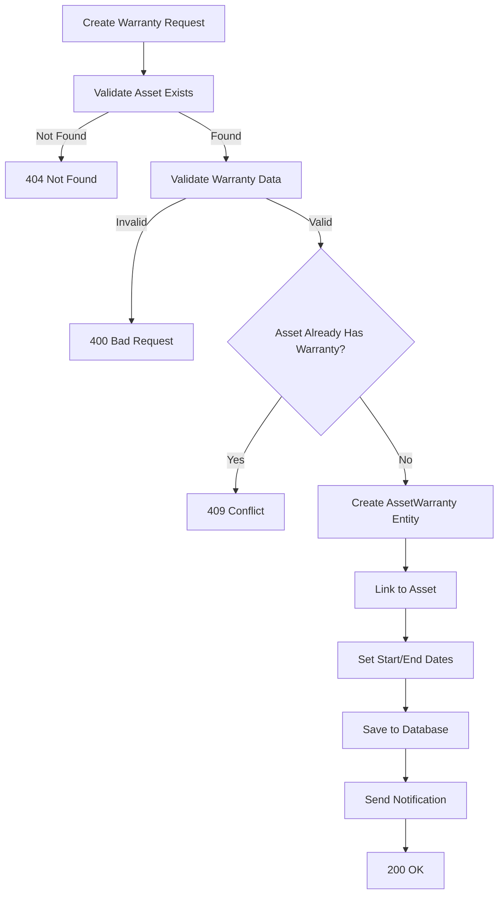
```mermaid
flowchart TD
   A[Create Warranty Request] --> B[Validate Asset Exists]
   B -->|Not Found| C[404 Not Found]
   B -->|Found| D[Validate Warranty Data]
   D -->|Invalid| E[400 Bad Request]
   D -->|Valid| F{Asset Already Has Warranty?}
   F -->|Yes| G[409 Conflict]
   F -->|No| H[Create AssetWarranty Entity]
   H --> I[Link to Asset]
   I --> J[Set Start/End Dates]
   J --> K[Save to Database]
   K --> L[Send Notification]
   L --> M[200 OK]
```


#### 4.9.2 AMC Management Flow


Similar to warranty but tracks Annual Maintenance Contracts with renewal dates and service provider information.


### 4.10 Bulk Operations Flow


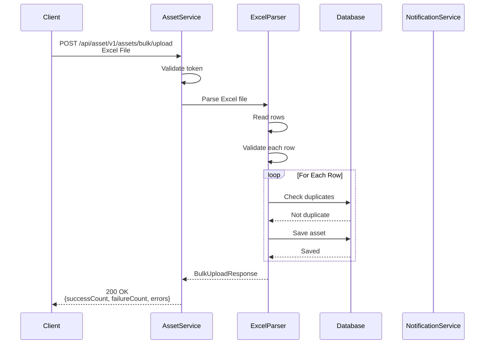
```mermaid
sequenceDiagram
   participant Client
   participant AssetService
   participant ExcelParser
   participant Database
   participant NotificationService


   Client->>AssetService: POST /api/asset/v1/assets/bulk/upload<br/>Excel File
   AssetService->>AssetService: Validate token
   AssetService->>ExcelParser: Parse Excel file
   ExcelParser->>ExcelParser: Read rows
   ExcelParser->>ExcelParser: Validate each row
   loop For Each Row
       ExcelParser->>Database: Check duplicates
       Database-->>ExcelParser: Not duplicate
       ExcelParser->>Database: Save asset
       Database-->>ExcelParser: Saved
   end
   ExcelParser-->>AssetService: BulkUploadResponse
   AssetService-->>Client: 200 OK<br/>{successCount, failureCount, errors}
```


### 4.11 API Endpoints Summary


| Method | Endpoint | Description |
|--------|----------|-------------|
| **Assets** | | |
| POST | `/api/asset/v1/assets` | Create asset |
| GET | `/api/asset/v1/assets` | List assets (paginated) |
| GET | `/api/asset/v1/assets/{id}` | Get asset by ID |
| PUT | `/api/asset/v1/assets/{id}` | Update asset |
| DELETE | `/api/asset/v1/assets/{id}` | Delete asset (soft) |
| POST | `/api/asset/v1/assets/bulk/upload` | Bulk upload (Excel) |
| **Categories** | | |
| POST | `/api/asset/v1/categories` | Create category |
| GET | `/api/asset/v1/categories` | List categories |
| PUT | `/api/asset/v1/categories/{id}` | Update category |
| DELETE | `/api/asset/v1/categories/{id}` | Delete category |
| **Makes** | | |
| POST | `/api/asset/v1/makes` | Create make |
| GET | `/api/asset/v1/makes` | List makes |
| **Models** | | |
| POST | `/api/asset/v1/models` | Create model |
| GET | `/api/asset/v1/models` | List models |
| **Vendors** | | |
| POST | `/api/asset/v1/vendors` | Create vendor |
| GET | `/api/asset/v1/vendors` | List vendors |
| **User Links** | | |
| POST | `/api/asset/v1/userlinks/link` | Link asset to user |
| POST | `/api/asset/v1/userlinks/delink` | Delink asset from user |
| POST | `/api/asset/v1/userlinks/multilink` | Link multiple assets |
| POST | `/api/asset/v1/userlinks/multidelink` | Delink multiple assets |
| **Warranty** | | |
| POST | `/api/asset/v1/warranty` | Create warranty |
| GET | `/api/asset/v1/warranty/{assetId}` | Get warranty |
| PUT | `/api/asset/v1/warranty/{id}` | Update warranty |
| **AMC** | | |
| POST | `/api/asset/v1/amc` | Create AMC |
| GET | `/api/asset/v1/amc/{assetId}` | Get AMC |
| PUT | `/api/asset/v1/amc/{id}` | Update AMC |
| **Documents** | | |
| POST | `/api/asset/v1/documents` | Upload document |
| GET | `/api/asset/v1/documents/{id}/download` | Download document |
| **Compliance** | | |
| POST | `/api/asset/v1/compliance/check` | Check compliance |


---


## 5. Notification-Service Detailed Functionality


### 5.1 Overview


The Notification-Service handles multi-channel notifications including SMS, Email, WhatsApp, and In-App notifications. It uses template-based messaging with dynamic variable substitution.


**Base URL:** `http://13.233.230.24:6002` 
**Port:** 6002 
**Database:** `notificationdb`


### 5.2 Core Features


1. **Multi-Channel Support** - SMS, Email, WhatsApp, In-App
2. **Template Management** - Pre-defined notification templates
3. **Dynamic Content** - Variable substitution in templates
4. **Notification History** - Complete logging of all notifications
5. **Asynchronous Processing** - Non-blocking notification sending
6. **Channel-Specific Logging** - Separate logs for each channel


### 5.3 Notification Flow


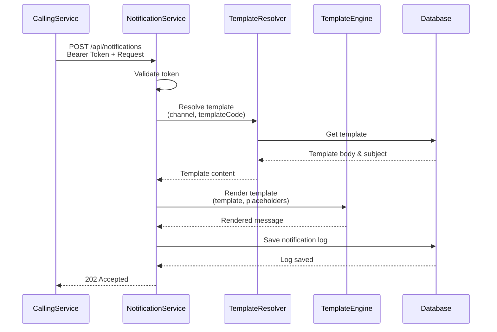
```mermaid
sequenceDiagram
   participant CallingService
   participant NotificationService
   participant TemplateResolver
   participant TemplateEngine
   participant Database


   CallingService->>NotificationService: POST /api/notifications<br/>Bearer Token + Request
   NotificationService->>NotificationService: Validate token
   NotificationService->>TemplateResolver: Resolve template<br/>(channel, templateCode)
   TemplateResolver->>Database: Get template
   Database-->>TemplateResolver: Template body & subject
   TemplateResolver-->>NotificationService: Template content
   NotificationService->>TemplateEngine: Render template<br/>(template, placeholders)
   TemplateEngine-->>NotificationService: Rendered message
   NotificationService->>Database: Save notification log
   Database-->>NotificationService: Log saved
   NotificationService-->>CallingService: 202 Accepted
```


### 5.4 Template System


#### 5.4.1 Template Structure


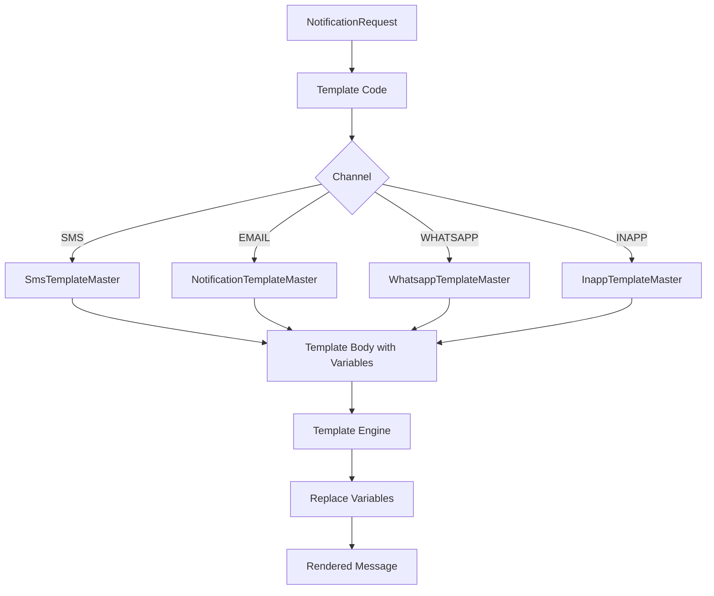
```mermaid
graph TD
   A[NotificationRequest] --> B[Template Code]
   B --> C{Channel}
   C -->|SMS| D[SmsTemplateMaster]
   C -->|EMAIL| E[NotificationTemplateMaster]
   C -->|WHATSAPP| F[WhatsappTemplateMaster]
   C -->|INAPP| G[InappTemplateMaster]
  
   D --> H[Template Body with Variables]
   E --> H
   F --> H
   G --> H
  
   H --> I[Template Engine]
   I --> J[Replace Variables]
   J --> K[Rendered Message]
```


#### 5.4.2 Template Example


**Template Code:** `ASSET_CREATED_SMS`


**Template Body:**
```
Dear {{username}}, your asset {{assetName}} (ID: {{assetId}}) has been created successfully on {{timestamp}}.
```


**Placeholders:**
```json
{
 "username": "John Doe",
 "assetName": "Laptop-DELL-001",
 "assetId": "123",
 "timestamp": "2024-01-15 10:30:00"
}
```


**Rendered Message:**
```
Dear John Doe, your asset Laptop-DELL-001 (ID: 123) has been created successfully on 2024-01-15 10:30:00.
```


### 5.5 Channel-Specific Processing


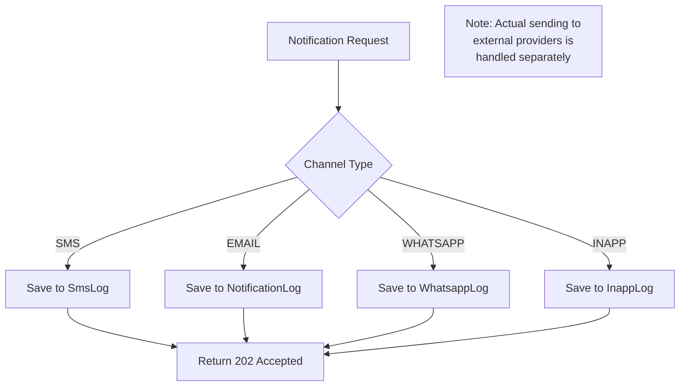
```mermaid
flowchart TD
   A[Notification Request] --> B{Channel Type}
   B -->|SMS| C[Save to SmsLog]
   B -->|EMAIL| D[Save to NotificationLog]
   B -->|WHATSAPP| E[Save to WhatsappLog]
   B -->|INAPP| F[Save to InappLog]
  
   C --> G[Return 202 Accepted]
   D --> G
   E --> G
   F --> G
  
   Note1[Note: Actual sending to<br/>external providers is<br/>handled separately]
```


### 5.6 Notification Request Format


```json
POST /api/notifications
Authorization: Bearer <token>
{
 "userId": 123,
 "username": "user@example.com",
 "mobile": "9876543210",
 "email": "user@example.com",
 "channel": "SMS",
 "templateCode": "ASSET_CREATED_SMS",
 "placeholders": {
   "assetName": "Laptop-DELL-001",
   "assetId": "123",
   "timestamp": "2024-01-15 10:30:00"
 },
 "audit": {
   "ipAddress": "192.168.1.1",
   "userAgent": "Mozilla/5.0",
   "sessionId": "456"
 },
 "projectType": "ASSET_SERVICE"
}
```


### 5.7 API Endpoints


| Method | Endpoint | Description |
|--------|----------|-------------|
| POST | `/api/notifications` | Send notification |


---


## 6. Integration Flows


### 6.1 Complete User Journey: Asset Creation


```mermaid
sequenceDiagram
   participant User
   participant Client
   participant AuthService
   participant AssetService
   participant NotificationService
   participant Database


   Note over User,Database: Step 1: Authentication
   User->>Client: Enter credentials
   Client->>AuthService: POST /api/auth/login
   AuthService->>Database: Validate user
   AuthService->>AuthService: Generate tokens
   AuthService-->>Client: {accessToken, refreshToken}
   Client->>Client: Store tokens


   Note over User,Database: Step 2: Create Asset
   User->>Client: Fill asset form
   Client->>AssetService: POST /api/asset/v1/assets<br/>Authorization: Bearer <token>
   AssetService->>AssetService: Validate token
   AssetService->>Database: Save asset
   Database-->>AssetService: Asset saved


   Note over User,Database: Step 3: Send Notification
   AssetService->>AssetService: Get token from SecurityContext
   AssetService->>NotificationService: POST /api/notifications<br/>Authorization: Bearer <token>
   NotificationService->>NotificationService: Validate token
   NotificationService->>Database: Save notification log
   NotificationService-->>AssetService: 202 Accepted
   AssetService-->>Client: 200 OK<br/>{asset data}
   Client->>User: Show success message
```


### 6.2 Token Propagation Flow


```mermaid
graph LR
   A[Client] -->|1. Login| B[Auth-Service]
   B -->|2. accessToken| A
   A -->|3. Request + Bearer Token| C[Asset-Service]
   C -->|4. Validate Token| C
   C -->|5. Extract Token from SecurityContext| C
   C -->|6. Forward + Bearer Token| D[Notification-Service]
   D -->|7. Validate Token| D
   D -->|8. Process| D
```


### 6.3 Error Handling Flow


```mermaid
flowchart TD
   A[Request] --> B{Token Present?}
   B -->|No| C[401 Unauthorized<br/>Missing Authorization header]
   B -->|Yes| D{Token Valid?}
   D -->|No| E[401 Unauthorized<br/>Invalid token]
   D -->|Yes| F{Token Expired?}
   F -->|Yes| G[401 Unauthorized<br/>Token expired<br/>Use refresh token]
   F -->|No| H[Process Request]
   H --> I{Business Logic Valid?}
   I -->|No| J[400 Bad Request<br/>Validation error]
   I -->|Yes| K{Entity Exists?}
   K -->|No| L[404 Not Found]
   K -->|Yes| M[200 OK]
```


---


## 7. API Reference


### 7.1 Common Request Headers


```http
Authorization: Bearer <accessToken>
Content-Type: application/json
```


### 7.2 Common Response Format


**Success Response:**
```json
{
 "success": true,
 "message": "Operation completed successfully",
 "data": { ... }
}
```


**Error Response:**
```json
{
 "success": false,
 "message": "Error description",
 "data": null
}
```


### 7.3 HTTP Status Codes


| Code | Meaning | Usage |
|------|---------|-------|
| 200 | OK | Successful GET, PUT, DELETE |
| 201 | Created | Successful POST (creation) |
| 202 | Accepted | Async operation accepted |
| 400 | Bad Request | Invalid request data |
| 401 | Unauthorized | Missing/invalid token |
| 403 | Forbidden | Insufficient permissions |
| 404 | Not Found | Resource not found |
| 409 | Conflict | Duplicate resource |
| 500 | Internal Server Error | Server error |


---


## 8. Use Cases & Scenarios


### 8.1 Use Case 1: New User Registration & First Asset Creation


**Scenario:** A new user registers and creates their first asset.


**Flow:**
1. User registers via `/api/auth/register`
2. User logs in via `/api/auth/login` (PASSWORD)
3. Receives accessToken
4. Creates a category (if needed)
5. Creates a make (if needed)
6. Creates a model (if needed)
7. Creates an asset
8. Receives notification about asset creation


**Sequence Diagram:**
```mermaid
sequenceDiagram
   participant User
   participant AuthService
   participant AssetService
   participant NotificationService


   User->>AuthService: Register
   AuthService-->>User: Registered
   User->>AuthService: Login
   AuthService-->>User: accessToken
   User->>AssetService: Create Category
   AssetService-->>User: Category created
   User->>AssetService: Create Make
   AssetService-->>User: Make created
   User->>AssetService: Create Model
   AssetService-->>User: Model created
   User->>AssetService: Create Asset
   AssetService->>NotificationService: Send notification
   AssetService-->>User: Asset created
```


### 8.2 Use Case 2: Bulk Asset Import


**Scenario:** Admin imports multiple assets from Excel file.


**Flow:**
1. Admin logs in
2. Prepares Excel file with asset data
3. Uploads file via `/api/asset/v1/assets/bulk/upload`
4. System validates and imports assets
5. Returns success/failure report


### 8.3 Use Case 3: Asset Assignment to User


**Scenario:** Admin assigns an asset to a user.


**Flow:**
1. Admin logs in
2. Calls `/api/asset/v1/userlinks/link`
3. System validates asset and user exist
4. Creates AssetUserLink
5. Sends notification to assigned user
6. Returns success


### 8.4 Use Case 4: Compliance Check


**Scenario:** System checks if asset is compliant with rules.


**Flow:**
1. User/System triggers compliance check
2. System retrieves active compliance rules
3. Validates asset against each rule
4. Creates violations if rules fail
5. Returns compliance result


---


## 9. Technical Specifications


### 9.1 Database Schema


#### 9.1.1 Auth-Service Schema


```mermaid
erDiagram
   USER ||--o{ SESSION : has
   USER ||--|| USER_DETAIL_MASTER : has
   SESSION ||--o{ REFRESH_TOKEN : has
   USER }o--o{ ROLE : has
  
   USER {
       bigint user_id PK
       string username_hash
       string password_enc
       boolean enabled
   }
  
   SESSION {
       bigint id PK
       bigint user_id FK
       string device_info
       datetime created_at
       datetime expires_at
       boolean revoked
   }
  
   REFRESH_TOKEN {
       bigint id PK
       string token_hash
       string access_token
       bigint session_id FK
       datetime expiry_date
       boolean active
   }
```


#### 9.1.2 Asset-Service Schema


```mermaid
erDiagram
   ASSET_MASTER ||--|| PRODUCT_CATEGORY : belongs_to
   ASSET_MASTER ||--|| PRODUCT_SUBCATEGORY : belongs_to
   ASSET_MASTER ||--|| PRODUCT_MAKE : belongs_to
   ASSET_MASTER ||--|| PRODUCT_MODEL : belongs_to
   ASSET_MASTER ||--|| VENDOR_MASTER : purchased_from
   ASSET_MASTER ||--o| ASSET_WARRANTY : has
   ASSET_MASTER ||--o| ASSET_AMC : has
   ASSET_MASTER ||--o{ ASSET_USER_LINK : linked_to
   ASSET_MASTER ||--o{ ASSET_DOCUMENT : has
   ASSET_MASTER ||--o{ ASSET_COMPONENT : has
  
   ASSET_MASTER {
       bigint asset_id PK
       string asset_name_udv
       bigint category_id FK
       bigint sub_category_id FK
       bigint make_id FK
       bigint model_id FK
       bigint vendor_id FK
       date purchase_date
       decimal purchase_price
   }
```


### 9.2 Security Specifications


#### 9.2.1 JWT Token Structure


**Header:**
```json
{
 "alg": "RS256",
 "typ": "JWT"
}
```


**Payload:**
```json
{
 "sub": "123",
 "uid": 123,
 "sid": 456,
 "username": "user@example.com",
 "roles": ["ROLE_USER"],
 "iat": 1703123456,
 "exp": 1703124356
}
```


#### 9.2.2 Password Encryption


- Algorithm: BCrypt
- Cost Factor: 10 (default)
- Salt: Auto-generated per password


#### 9.2.3 PII Data Hashing


- Algorithm: HMAC-SHA256
- Purpose: Uniqueness checking without storing plain PII
- Fields: username, email, mobile


### 9.3 Performance Specifications


| Operation | Expected Response Time |
|-----------|----------------------|
| Login | < 500ms |
| Token Validation | < 50ms |
| Asset Creation | < 1s |
| Asset List (100 items) | < 500ms |
| Notification Send | < 200ms (async) |
| Bulk Upload (100 assets) | < 10s |


### 9.4 Scalability


- **Horizontal Scaling**: All services are stateless and can be scaled horizontally
- **Database**: Read replicas for read-heavy operations
- **Caching**: Redis (optional) for frequently accessed data
- **Load Balancing**: Round-robin or least-connections


---


## 10. Error Handling & Troubleshooting


### 10.1 Common Errors


#### 10.1.1 Authentication Errors


| Error | Cause | Solution |
|-------|-------|----------|
| 401 Unauthorized - Missing Authorization header | Token not sent | Include `Authorization: Bearer <token>` header |
| 401 Unauthorized - Invalid token | Token signature invalid | Regenerate token via login |
| 401 Unauthorized - Token expired | Token past expiration | Use refresh token to get new access token |


#### 10.1.2 Validation Errors


| Error | Cause | Solution |
|-------|-------|----------|
| 400 Bad Request - Asset name required | Missing required field | Provide asset name |
| 409 Conflict - Asset already exists | Duplicate asset name | Use unique asset name |
| 404 Not Found - Category not found | Invalid category ID | Use valid category ID |


### 10.2 Troubleshooting Guide


#### 10.2.1 Token Issues


**Problem:** Token validation fails 
**Check:**
1. Token format: `Bearer <token>` (with space)
2. Token not expired
3. JWT public key matches across services
4. Token signature algorithm matches (RS256 vs HS256)


**Solution:**
- Re-login to get new token
- Check JWT configuration in all services


#### 10.2.2 Notification Not Received


**Problem:** Notification sent but not received 
**Check:**
1. Notification log in database
2. Template exists for templateCode
3. Placeholders correctly formatted
4. Channel configuration correct


**Solution:**
- Check notification logs
- Verify template exists
- Check external provider configuration (SMS/Email gateway)


#### 10.2.3 Asset Creation Fails


**Problem:** Asset creation returns error 
**Check:**
1. All required fields provided
2. Referenced entities exist (category, make, model)
3. Asset name is unique
4. User has permission


**Solution:**
- Validate request payload
- Check master data exists
- Verify user permissions


### 10.3 Logging


All services use SLF4J with Logback for logging:


- **Level:** DEBUG in development, INFO in production
- **Format:** Timestamp, Level, Logger, Message
- **Location:** Console and log files


**Example Log Entry:**
```
2024-01-15 10:30:00.123 INFO  [AssetController] 📥 [POST] /assets - Creating asset for userId=123 username=user@example.com
```


---


## Appendix A: Quick Start Guide


### A.1 Prerequisites


- Java 17+
- Maven 3.8+
- MySQL 8.0+
- IDE (IntelliJ IDEA / Eclipse)


### A.2 Setup Steps


1. **Clone Repository**
  ```bash
  git clone <repository-url>
  cd microservices-architecture-blueprint
  ```


2. **Configure Databases**
  ```sql
  CREATE DATABASE authdb;
  CREATE DATABASE assetdb;
  CREATE DATABASE notificationdb;
  ```


3. **Update Configuration**
  - Edit `application.yml` in each service
  - Set database credentials
  - Configure JWT keys


4. **Build Services**
  ```bash
  mvn clean package -f auth-service/pom.xml
  mvn clean package -f asset-service/pom.xml
  mvn clean package -f notification-service/pom.xml
  ```


5. **Run Services**
  ```bash
  java -jar auth-service/target/auth-service-*.jar
  java -jar asset-service/target/asset-service-*.jar
  java -jar notification-service/target/notification-service-*.jar
  ```


### A.3 Test API


1. **Register User**
  ```bash
  curl -X POST http://localhost:6001/api/auth/register \
    -H "Content-Type: application/json" \
    -d '{"username":"test@example.com","password":"Test123","email":"test@example.com","mobile":"9876543210","projectType":"ASSET_SERVICE"}'
  ```


2. **Login**
  ```bash
  curl -X POST http://localhost:6001/api/auth/login \
    -H "Content-Type: application/json" \
    -d '{"loginType":"PASSWORD","username":"test@example.com","password":"Test123","deviceInfo":"Test Device"}'
  ```


3. **Create Asset** (use token from login)
  ```bash
  curl -X POST http://localhost:6003/api/asset/v1/assets \
    -H "Authorization: Bearer <token>" \
    -H "Content-Type: application/json" \
    -d '{"userId":1,"username":"test@example.com","projectType":"ASSET_SERVICE","asset":{"assetNameUdv":"Test Asset"}}'
  ```


---


## Appendix B: API Testing with Postman


### B.1 Postman Collection


Import the provided Postman collections:
- `auth-service/docs/postman/Auth_Controller.postman_collection.json`
- `asset-service/docs/postman/Asset_Controller.postman_collection.json`


### B.2 Environment Variables


Set up environment variables in Postman:
- `base_url_auth`: `http://localhost:6001`
- `base_url_asset`: `http://localhost:6003`
- `base_url_notification`: `http://localhost:6002`
- `access_token`: (set after login)


### B.3 Automated Token Management


Use Postman pre-request scripts to automatically get and set tokens:


```javascript
// Pre-request script for asset-service endpoints
if (!pm.environment.get("access_token")) {
   pm.sendRequest({
       url: pm.environment.get("base_url_auth") + "/api/auth/login",
       method: 'POST',
       header: {'Content-Type': 'application/json'},
       body: {
           mode: 'raw',
           raw: JSON.stringify({
               loginType: "PASSWORD",
               username: "test@example.com",
               password: "Test123",
               deviceInfo: "Postman"
           })
       }
   }, function (err, res) {
       if (res.json().accessToken) {
           pm.environment.set("access_token", res.json().accessToken);
       }
   });
}
```


---


## Document Revision History


| Version | Date | Author | Changes |
|---------|------|--------|----------|
| 1.0.0 | 2024-01-15 | System | Initial documentation |


---


**End of Document**


