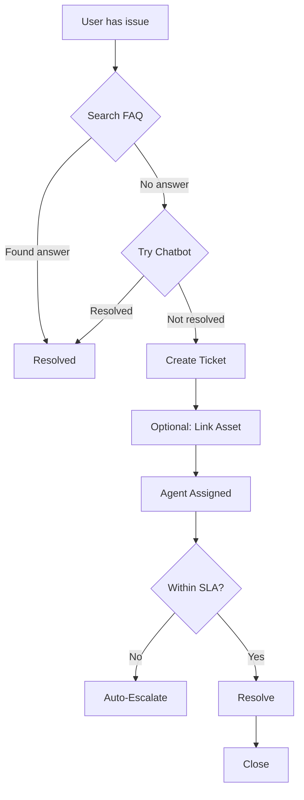

# Business Requirements Document (BRD)
## Keeply — Complete Asset Lifecycle Management Platform

| Field | Value |
|-------|-------|
| **Document Title** | Business Requirements Document |
| **Product Name** | Keeply |
| **Program** | Complete Asset Lifecycle Management |
| **Version** | 1.0.0 |
| **Status** | Approved for Planning |
| **Last Updated** | July 2026 |
| **Document Owner** | Product Management |
| **Classification** | Internal — Business & Product |

**Related Documents:**
- [EPICS_FEATURES_USER_STORIES.md](./EPICS_FEATURES_USER_STORIES.md) — Product backlog (epics, features, user stories)
- [SOFTWARE_REQUIREMENTS_SPECIFICATION_FRD.md](./SOFTWARE_REQUIREMENTS_SPECIFICATION_FRD.md) — Combined SRS/FRD
- [TECHNICAL_FUNCTIONAL_DOCUMENT.md](./TECHNICAL_FUNCTIONAL_DOCUMENT.md) — Technical specification
- [Technical Functionality Documentation](../Technical%20Functionality%20Documentation.md) — Detailed functional guide
- [COMMUNICATION_OPT_OUT.md](./COMMUNICATION_OPT_OUT.md) — Communication preferences policy
- [BLOCK_UNBLOCK_PDPA_COMPLIANCE.md](./BLOCK_UNBLOCK_PDPA_COMPLIANCE.md) — Account restriction & privacy policy

---

## Table of Contents

1. [Executive Summary](#1-executive-summary)
2. [Business Background](#2-business-background)
3. [Problem Statement](#3-problem-statement)
4. [Business Objectives & Success Criteria](#4-business-objectives--success-criteria)
5. [Stakeholders](#5-stakeholders)
6. [Scope](#6-scope)
7. [User Personas](#7-user-personas)
8. [Business Capabilities Overview](#8-business-capabilities-overview)
9. [Functional Business Requirements](#9-functional-business-requirements)
10. [Business Rules](#10-business-rules)
11. [Non-Functional Business Requirements](#11-non-functional-business-requirements)
12. [Compliance & Regulatory Requirements](#12-compliance--regulatory-requirements)
13. [Key Business Processes & User Journeys](#13-key-business-processes--user-journeys)
14. [Assumptions, Constraints & Dependencies](#14-assumptions-constraints--dependencies)
15. [Risks & Mitigations](#15-risks--mitigations)
16. [Business Roadmap & Phasing](#16-business-roadmap--phasing)
17. [Requirements Traceability](#17-requirements-traceability)
18. [Glossary](#18-glossary)
19. [Document Approval](#19-document-approval)

---

## 1. Executive Summary

### 1.1 Purpose of This Document

This Business Requirements Document (BRD) defines **what** the Keeply platform must achieve from a business perspective — the problems it solves, the value it delivers, the stakeholders it serves, and the measurable outcomes that define success. It is the authoritative business reference for product, engineering, compliance, and operations teams.

This document intentionally avoids implementation detail. Technical specifications, API contracts, and sprint-level user stories are maintained in companion documents, principally [EPICS_FEATURES_USER_STORIES.md](./EPICS_FEATURES_USER_STORIES.md).

### 1.2 Product Overview

**Keeply** is a digital asset lifecycle management platform that helps **homeowners, renters, and small businesses** register, organize, and maintain physical assets — appliances, electronics, vehicles, and equipment — throughout their useful life.

The platform consists of:

| Layer | Components |
|-------|------------|
| **Mobile experience** | Keeply Flutter app (primary consumer channel) |
| **Core services** | Identity (auth), Asset registry, Notifications, Helpdesk support |
| **Shared foundation** | Common security, encryption, and integration library |

Users can capture purchase details, store invoices and warranty documents, receive expiry reminders, raise support tickets, and manage their account securely — all from a single mobile application backed by independently scalable microservices.

### 1.3 Strategic Value Proposition

| For | Value |
|-----|-------|
| **End users** | Never miss a warranty claim; all asset paperwork in one place; faster support |
| **Small businesses** | Structured asset register with assignment, compliance, and audit trail |
| **Operations** | Reduced support load via self-service FAQ and chatbot |
| **Compliance** | Privacy-by-design with encrypted PII, opt-out, and auditability |
| **Business** | Extensible platform for future e-commerce (ECOM) and enterprise (ASSET_MGMT) project types |

### 1.4 Summary of Business Requirements

The platform must deliver **six core business capability areas**:

1. **Secure identity and account management**
2. **Asset registration and lifecycle tracking**
3. **Proactive coverage and maintenance awareness**
4. **Multi-channel,user-controlled communications**
5. **Structured customer support with SLA accountability**
6. **Mobile-first user experience**

---

## 2. Business Background

### 2.1 Market Context

Consumers and small businesses own increasing numbers of high-value physical assets, each with warranties, service contracts, and documentation scattered across email, paper receipts, and manufacturer portals. When an appliance fails:

- Users often cannot locate warranty terms or proof of purchase in time.
- Manufacturer support requires serial numbers and purchase dates the user does not have at hand.
- Missed warranty expiry dates result in unnecessary out-of-pocket repair costs.

Existing solutions are fragmented: note-taking apps lack structure; manufacturer apps are brand-specific; enterprise asset management systems are too complex and expensive for personal use.

### 2.2 Business Opportunity

Keeply addresses this gap with a **consumer-grade, enterprise-architected** platform:

- **Personal asset registry** with structured taxonomy (room/category, make, model)
- **Document vault** for invoices, warranty cards, and AMC agreements
- **Proactive reminders** before coverage lapses
- **Integrated support** from self-service through ticketed escalation
- **Regulatory readiness** for markets governed by DPDPA (India) and PDPA (Singapore and similar frameworks)

### 2.3 Program History & Current State

The program is implemented as a **microservices architecture blueprint** with working services and a Flutter mobile client. Core capabilities — registration, login, asset creation, warranty tracking, in-app notifications, and helpdesk tickets — are built. External notification delivery (SMS/email/push providers) and some integration gaps are identified as future business enhancements (see Section 15).

### 2.4 Business Drivers

| Driver | Description |
|--------|-------------|
| **Customer retention** | Reminders and support create ongoing engagement beyond one-time registration |
| **Trust & compliance** | PII protection and communication consent are prerequisites for market entry |
| **Operational efficiency** | Self-service and SLA-driven support reduce cost per ticket |
| **Platform extensibility** | Microservices and project types (ECOM, ASSET) enable future product lines |
| **Data asset** | Structured asset and catalog data supports analytics, partnerships, and AI features |

---

## 3. Problem Statement

### 3.1 Current Pain Points

| # | Pain Point | Business Impact |
|---|------------|-----------------|
| P1 | Warranty and AMC expiry dates are forgotten or stored inconsistently | Financial loss; customer dissatisfaction when claims are denied |
| P2 | Invoices and warranty documents are lost or hard to retrieve | Delayed repairs; inability to prove ownership or coverage |
| P3 | No single view of household or business assets | Poor planning for maintenance, insurance, and resale |
| P4 | Support is fragmented across brands, retailers, and platforms | High effort to resolve issues; repeat explanations |
| P5 | Users lack control over how companies contact them | Regulatory risk; erosion of trust |
| P6 | Personal data stored in plaintext or without audit trails | Compliance violations; reputational damage |

### 3.2 Target State

Keeply will provide a **trusted, mobile-first asset companion** where users:

1. Register once and securely access all features.
2. Add assets in minutes with photos, invoices, and warranty dates.
3. See a dashboard of what needs attention (expiring coverage, open tickets, unread alerts).
4. Get notified before warranties expire — on channels they have not opted out of.
5. Resolve issues via FAQ, chatbot, or support ticket with clear SLA expectations.
6. Control their data — profile, communication preferences, and account deletion.

### 3.3 Out-of-Scope Problems (Explicitly Not Solved in v1)

- Payment processing or e-commerce checkout
- Direct integration with every manufacturer RMA portal
- Full enterprise ERP/asset accounting replacement
- Insurance policy administration (future integration possible)
- Real-time IoT device monitoring

---

## 4. Business Objectives & Success Criteria

### 4.1 Primary Business Objectives

| ID | Objective | Description |
|----|-----------|-------------|
| **BO-01** | Increase warranty utilization | Help users file claims before coverage expires |
| **BO-02** | Centralize asset documentation | Single repository for invoices, photos, and contracts |
| **BO-03** | Build user trust through privacy | Encrypt PII; honor opt-out; support data rights |
| **BO-04** | Reduce support cost per user | Self-service FAQ/chatbot before human tickets |
| **BO-05** | Enable scalable platform growth | Microservices support new channels and project types |
| **BO-06** | Deliver mobile-first adoption | Flutter app as primary user interface |

### 4.2 Key Performance Indicators (KPIs)

| KPI | Definition | Target (12 months post-launch) | Measurement Source |
|-----|------------|-------------------------------|-------------------|
| **KPI-01** | Registered active users | 10,000+ monthly active users | auth-service analytics |
| **KPI-02** | Assets registered per active user | ≥ 3 assets average | asset-service |
| **KPI-03** | Complete asset creation rate | ≥ 70% of new assets include warranty + invoice | asset-service documents |
| **KPI-04** | Warranty reminder engagement | ≥ 40% of reminder recipients view asset within 7 days | notification + app analytics |
| **KPI-05** | Self-service resolution rate | ≥ 50% of support intents resolved without ticket | helpdesk FAQ/chatbot vs issues |
| **KPI-06** | Ticket SLA compliance | ≥ 90% first-response within SLA | helpdesk SLA tracking |
| **KPI-07** | Communication opt-out compliance | 100% — no sends on opted-out channels | notification-service audit |
| **KPI-08** | Account security incidents | < 0.1% of accounts with unauthorized access | auth audit logs |
| **KPI-09** | App session retention (D30) | ≥ 25% of registrants active at day 30 | Flutter analytics |
| **KPI-10** | Support ticket CSAT | ≥ 4.0 / 5.0 (when survey introduced) | helpdesk post-resolution |

### 4.3 Success Criteria for MVP Release

The Minimum Viable Product (MVP) is successful when a new user can:

1. Register and log in on the Keeply mobile app.
2. Add an asset with category, warranty dates, and invoice upload in one flow.
3. View assigned assets and coverage reminders on the dashboard.
4. Receive in-app notifications for warranty-related alerts.
5. Browse FAQs and create a support ticket linked to an asset.
6. Update communication preferences and trust that opt-out is honored.

---

## 5. Stakeholders

### 5.1 Stakeholder Register

| Stakeholder | Role | Interest | Influence |
|-------------|------|----------|-----------|
| **Product Owner** | Defines priorities and accepts deliverables | Feature scope, roadmap, KPIs | High |
| **End User (Homeowner)** | Primary consumer of Keeply mobile app | Ease of use, reminders, document storage | Medium |
| **Small Business Owner** | Uses asset register for equipment | Assignment, compliance, bulk import | Medium |
| **Customer Support Manager** | Operates helpdesk queues | SLA, escalation, agent tools | High |
| **Platform Administrator** | Manages users, catalog, T&C | Admin APIs, audit, blocking | High |
| **Compliance / Legal** | DPDPA/PDPA adherence | Encryption, opt-out, audit, deletion | High |
| **Engineering Lead** | Delivers technical solution | Architecture, APIs, quality | High |
| **DevOps / SRE** | Runs production environment | Uptime, deployment, monitoring | Medium |
| **QA Lead** | Validates requirements | Test coverage, acceptance criteria | Medium |
| **Executive Sponsor** | Funds program | ROI, time-to-market, risk | High |

### 5.2 RACI Matrix (Key Decisions)

| Decision | Product | Engineering | Compliance | Support | Executive |
|----------|---------|-------------|--------------|---------|-----------|
| MVP scope | **A** | C | C | C | I |
| Privacy policy & T&C | C | I | **A** | I | I |
| SLA targets | C | I | I | **A** | I |
| Go-live approval | **A** | R | C | C | **A** |
| Communication channel rollout | **A** | R | C | I | I |

*R = Responsible, A = Accountable, C = Consulted, I = Informed*

---

## 6. Scope

### 6.1 In Scope

| # | Area | Business Description |
|---|------|---------------------|
| S1 | **Identity & access** | Registration, multi-method login, profiles, sessions, admin user management |
| S2 | **Asset lifecycle** | Register, classify, assign, update, retire assets; warranty & AMC |
| S3 | **Document management** | Store and retrieve invoices, photos, warranty/AMC documents |
| S4 | **Catalog & master data** | Categories, subcategories, makes, models, vendors, outlets |
| S5 | **Notifications** | Template-based alerts; in-app inbox; opt-out enforcement |
| S6 | **Helpdesk & support** | Tickets, FAQs, knowledge base, queries, SLA, escalation, chatbot |
| S7 | **Mobile app** | Keeply Flutter app — dashboard, asset creation, alerts, support |
| S8 | **Compliance & privacy** | PII encryption, communication consent, audit, account restrictions |
| S9 | **Platform foundation** | Shared security, API standards, inter-service integration |

### 6.2 Out of Scope (Current Release)

| # | Area | Rationale |
|---|------|-----------|
| O1 | keeply_react_app (web) | Separate product backlog; mobile is primary channel |
| O2 | E-commerce checkout & payments | Different business domain (ECOM templates exist for future) |
| O3 | Native push via FCM/APNs | Planned; in-app channel delivered first |
| O4 | Live SMS/email/WhatsApp provider dispatch | Log/queue model in place; provider integration is Phase 6 |
| O5 | Manufacturer warranty API integrations | Requires per-brand partnerships |
| O6 | Enterprise SSO (SAML/OIDC) | Future enterprise tier |
| O7 | Multi-tenant B2B white-label | Future platform offering |

### 6.3 Geographic & Regulatory Scope

- **Primary markets:** India (DPDPA), with design patterns compatible with PDPA (Singapore) and similar privacy frameworks.
- **Languages (MVP):** English UI; localization is a future business requirement.
- **Data residency:** PostgreSQL (Supabase-compatible); deployment region configurable per environment.

---

## 7. User Personas

### 7.1 Primary Persona: Priya — Homeowner

| Attribute | Detail |
|-----------|--------|
| **Age** | 34 |
| **Context** | Owns a 3BHK apartment; multiple appliances with varying warranty periods |
| **Goals** | Track warranties, store invoices, get reminded before expiry |
| **Frustrations** | Lost paper receipts; forgot AC warranty expired last year |
| **Tech comfort** | High — uses mobile apps daily |
| **Keeply usage** | Flutter app: register assets, dashboard reminders, alerts inbox |

**Representative quote:** *"I want one app that tells me when my washing machine warranty is about to end and where I saved the invoice."*

### 7.2 Secondary Persona: Rajesh — Small Business Owner

| Attribute | Detail |
|-----------|--------|
| **Context** | Runs a café with 15+ pieces of equipment |
| **Goals** | Assign assets to staff, track AMC, bulk import catalog |
| **Frustrations** | Spreadsheets are outdated; no audit trail on changes |
| **Keeply usage** | Admin APIs, bulk Excel upload, compliance reports |

### 7.3 Persona: Anita — Support Agent (L1)

| Attribute | Detail |
|-----------|--------|
| **Goals** | Resolve tickets within SLA; escalate complex issues |
| **Frustrations** | Missing asset context; no SLA visibility |
| **Keeply usage** | helpdesk-service: assign, resolve, escalate, SLA dashboard |

### 7.4 Persona: Vikram — Platform Administrator

| Attribute | Detail |
|-----------|--------|
| **Goals** | Manage users, block abusive accounts, export audit logs |
| **Keeply usage** | auth-service admin APIs; catalog management on asset-service |

### 7.5 Persona: Meera — Compliance Officer

| Attribute | Detail |
|-----------|--------|
| **Goals** | Ensure PII encrypted, opt-out honored, block actions audited |
| **Keeply usage** | Compliance documentation; field-level decrypt policies; audit export |

---

## 8. Business Capabilities Overview

### 8.1 Capability Map

```
┌─────────────────────────────────────────────────────────────────────────┐
│                    KEEPLY BUSINESS CAPABILITIES                          │
├─────────────────┬─────────────────┬─────────────────┬───────────────────┤
│  TRUST & ACCESS │  ASSET VALUE    │  ENGAGEMENT     │  SUPPORT          │
├─────────────────┼─────────────────┼─────────────────┼───────────────────┤
│ • Registration  │ • Asset registry│ • Reminders     │ • Self-service FAQ│
│ • Login (multi) │ • Warranty/AMC  │ • In-app alerts │ • Chatbot         │
│ • Profile       │ • Documents     │ • Opt-out prefs │ • Tickets & SLA   │
│ • Admin control │ • Assignment    │ • Templates     │ • Escalation      │
│ • Audit         │ • Scan/OCR      │                 │ • Knowledge base  │
│ • PII protection│ • Compliance    │                 │                   │
└─────────────────┴─────────────────┴─────────────────┴───────────────────┘
                              │
                    ┌─────────▼─────────┐
                    │  MOBILE EXPERIENCE │
                    │  (keeply_flutter)  │
                    └───────────────────┘
```

### 8.2 Capability-to-Service Mapping

| Business Capability | Primary Service | Supporting |
|--------------------|-----------------|------------|
| User identity & sessions | auth-service | common-service |
| Asset registry & lifecycle | asset-service | auth-service (JWT) |
| Warranty & document vault | asset-service | notification-service |
| Alerts & inbox | notification-service | auth-service (opt-out) |
| Customer support | helpdesk-service | asset-service (asset link) |
| Mobile UX | keeply_flutter_app | All four services |
| Security & encryption | common-service | All services |

---

## 9. Functional Business Requirements

Business requirements are numbered **BR-xxx**. Priority: **Must** (MVP), **Should** (near-term), **Could** (future).

---

### 9.1 Identity, Registration & Access (auth-service)

| ID | Priority | Requirement |
|----|----------|-------------|
| **BR-101** | Must | The system shall allow new users to register with email, mobile, and password, accepting the current Terms & Conditions version. |
| **BR-102** | Must | The system shall support login via password and OTP at minimum for MVP. |
| **BR-103** | Should | The system shall support additional login methods: MPIN, RSA, WebAuthn/passkey, and auth code for advanced users and integrations. |
| **BR-104** | Must | The system shall issue secure session tokens (access + refresh) upon successful authentication. |
| **BR-105** | Must | The system shall allow users to log out and invalidate their active session. |
| **BR-106** | Must | The system shall allow users to view and update their profile including address, contact details, and profile photo. |
| **BR-107** | Must | The system shall require OTP verification for email or mobile number changes. |
| **BR-108** | Must | The system shall allow users to soft-delete their account while retaining audit records per policy. |
| **BR-109** | Must | The system shall support admin registration and role-based access (`ROLE_USER`, `ROLE_ADMIN`). |
| **BR-110** | Must | Administrators shall be able to list users, view decrypted profiles (authorized), block, unblock, and permanently block accounts with documented reasons. |
| **BR-111** | Must | All authentication and admin security events shall be recorded in an exportable audit log. |
| **BR-112** | Should | The system shall manage versioned Terms & Conditions per project type (ECOM, ASSET). |
| **BR-113** | Should | The system shall support project type master data to scope users and templates. |
| **BR-114** | Must | The system shall lock accounts after repeated failed login attempts per security policy. |

---

### 9.2 Asset Registration & Lifecycle (asset-service)

| ID | Priority | Requirement |
|----|----------|-------------|
| **BR-201** | Must | Users shall be able to register an asset with name, serial number, purchase information, and classification (category hierarchy). |
| **BR-202** | Must | Users shall be able to create an asset in a single flow including warranty dates, invoice upload, optional photo, and self-assignment. |
| **BR-203** | Must | Users shall be able to view, search, update, and delete their assigned assets. |
| **BR-204** | Must | The system shall maintain a hierarchical product catalog: Category → SubCategory → Make → Model. |
| **BR-205** | Must | Users shall be able to attach warranty and AMC records with start/end dates to each asset. |
| **BR-206** | Must | Users shall be able to upload and download documents (invoices, warranty cards, photos) linked to assets. |
| **BR-207** | Must | The system shall assign assets and components to users so each user sees only their relevant items. |
| **BR-208** | Must | The system shall provide a consolidated "needs attention" view for warranty/AMC nearing expiry. |
| **BR-209** | Should | Users shall be able to scan barcodes or QR codes to identify or register assets. |
| **BR-210** | Should | Administrators shall be able to bulk import assets and master data via Excel templates. |
| **BR-211** | Should | Users shall be able to mark favourite assets and control display ordering on the dashboard. |
| **BR-212** | Should | The system shall support attachable components (e.g., filters, remotes) linked to parent assets. |
| **BR-213** | Should | The system shall record vendor and purchase outlet information with assets. |
| **BR-214** | Could | The system shall extract product details from label photos using OCR. |
| **BR-215** | Could | The system shall extract invoice fields using intelligent document parsing or LLM. |
| **BR-216** | Should | Administrators shall be able to define and enforce compliance rules with violation tracking and reports. |
| **BR-217** | Should | All significant asset operations shall be recorded in a searchable audit trail. |

---

### 9.3 Notifications & User Communications (notification-service)

| ID | Priority | Requirement |
|----|----------|-------------|
| **BR-301** | Must | The system shall send notifications using predefined templates with dynamic placeholders (e.g., asset name, expiry date). |
| **BR-302** | Must | The system shall support notification channels: In-App (MVP), with SMS, Email, and WhatsApp templates ready for provider integration. |
| **BR-303** | Must | Users shall have an in-app notification inbox with read/unread status and unread count. |
| **BR-304** | Must | Users shall be able to mark notifications as read, unread, or mark all read. |
| **BR-305** | Must | The system shall not send notifications on channels the user has opted out of. |
| **BR-306** | Must | OTP and security-critical messages shall be deliverable per policy even when marketing opt-out applies (configurable). |
| **BR-307** | Must | All notification attempts shall be logged per channel for audit and future replay. |
| **BR-308** | Should | Asset lifecycle events (warranty expiry, assignment, bulk upload completion) shall trigger appropriate notification templates. |
| **BR-309** | Could | Native push notifications shall be supported with user opt-out (`optOutPush`). |
| **BR-310** | Should | Failed notification deliveries shall be retried and persisted for operational recovery. |

---

### 9.4 Customer Support & Helpdesk (helpdesk-service)

| ID | Priority | Requirement |
|----|----------|-------------|
| **BR-401** | Must | Users shall be able to create support tickets with title, description, priority, and related service. |
| **BR-402** | Must | Users shall be able to link tickets to specific assets, components, or predefined issue types. |
| **BR-403** | Must | Users shall be able to view all tickets they have raised. |
| **BR-404** | Must | Support agents shall be able to assign, update status, resolve, and close tickets. |
| **BR-405** | Must | The system shall support ticket statuses: Open, In Progress, Resolved, Closed, Reopened. |
| **BR-406** | Should | The system shall maintain a catalog of predefined issue types linked to asset taxonomy. |
| **BR-407** | Must | Users shall be able to search and browse FAQs before creating a ticket. |
| **BR-408** | Should | Users shall be able to submit queries (questions) and receive agent answers. |
| **BR-409** | Should | Administrators shall be able to manage FAQ content, featured articles, and service knowledge base. |
| **BR-410** | Should | The system shall provide a rule-based chatbot for instant answers from FAQs and knowledge articles. |
| **BR-411** | Must | The system shall define SLA targets per service, priority, and support level (L1/L2/L3). |
| **BR-412** | Must | The system shall track first-response and resolution times against SLA. |
| **BR-413** | Should | The system shall auto-escalate tickets when SLA is breached. |
| **BR-414** | Should | Support managers shall be able to view all SLA breaches. |
| **BR-415** | Could | Users shall receive in-app notifications when ticket status changes (assign, resolve). |

---

### 9.5 Mobile Application (keeply_flutter_app)

| ID | Priority | Requirement |
|----|----------|-------------|
| **BR-501** | Must | The mobile app shall provide registration, login, and secure session management. |
| **BR-502** | Must | The mobile app shall provide a dashboard showing user assets, coverage reminders, and alert badges. |
| **BR-503** | Must | The mobile app shall provide guided asset creation with catalog pickers and document upload. |
| **BR-504** | Must | The mobile app shall provide an alerts hub for in-app notifications. |
| **BR-505** | Should | The mobile app shall provide browse-by-room view of assets. |
| **BR-506** | Should | The mobile app shall provide helpdesk access: FAQs, ticket list, and ticket creation. |
| **BR-507** | Should | The mobile app shall support barcode scanning to identify assets. |
| **BR-508** | Must | The mobile app shall automatically refresh expired authentication tokens. |
| **BR-509** | Should | The mobile app shall indicate network connectivity status to the user. |
| **BR-510** | Should | The mobile app shall allow profile editing and sign-out from an account hub. |
| **BR-511** | Could | The mobile app shall provide AI-assisted tips and support chat (local Ollama). |
| **BR-512** | Could | The mobile app shall support light/dark theme and accessibility preferences. |

---

### 9.6 Platform & Integration (common-service + cross-cutting)

| ID | Priority | Requirement |
|----|----------|-------------|
| **BR-601** | Must | All services shall use a consistent API response format for success and error states. |
| **BR-602** | Must | All services shall validate JWT tokens from auth-service for protected endpoints. |
| **BR-603** | Must | PII shall be encrypted at rest in all services storing sensitive user data. |
| **BR-604** | Must | A single user login shall grant access to auth, asset, notification, and helpdesk APIs. |
| **BR-605** | Should | Inter-service calls shall propagate authentication context where required. |
| **BR-606** | Should | Services shall support deployment on cloud platforms (Render, Supabase PostgreSQL). |
| **BR-607** | Should | API documentation (OpenAPI/Swagger) shall be available for all deployable services. |

---

## 10. Business Rules

Business rules define **conditions and constraints** that govern platform behavior independent of implementation.

### 10.1 Identity & Account Rules

| Rule ID | Rule | Rationale |
|---------|------|-----------|
| **BUS-R01** | A user must accept the active Terms & Conditions version to complete registration. | Legal compliance |
| **BUS-R02** | Email and mobile must be unique per project type within the system. | Data integrity |
| **BUS-R03** | Access tokens expire after approximately 15 minutes; refresh tokens after approximately 14 days. | Security balance |
| **BUS-R04** | Only users with `ROLE_ADMIN` may access admin APIs (user list, block, audit export, bulk decrypt). | Least privilege |
| **BUS-R05** | Temporary block must include a reason; permanent block requires documented reason and admin role. | PDPA accountability |
| **BUS-R06** | Soft-deleted users cannot log in; audit history is retained per retention policy. | Data subject rights + audit |
| **BUS-R07** | Users may only view decrypted PII for their own account unless admin-authorized. | Purpose limitation |

### 10.2 Asset Rules

| Rule ID | Rule | Rationale |
|---------|------|-----------|
| **BUS-R08** | An asset must belong to a valid category in the catalog hierarchy. | Data quality |
| **BUS-R09** | Warranty end date must be on or after warranty start date when both are provided. | Logical consistency |
| **BUS-R10** | Users see only assets assigned to them unless they hold an admin role. | Privacy |
| **BUS-R11** | Document uploads must match allowed document types and size limits. | Security & storage |
| **BUS-R12** | "Needs attention" includes items with warranty or AMC expiring within the configured threshold (default 14 days). | Business policy |
| **BUS-R13** | Deleting an asset does not automatically delete audit history of operations on that asset. | Compliance |

### 10.3 Notification Rules

| Rule ID | Rule | Rationale |
|---------|------|-----------|
| **BUS-R14** | If `optOutSms = true`, no SMS notifications shall be sent to that user. | Consent |
| **BUS-R15** | If `optOutEmail = true`, no email notifications shall be sent. | Consent |
| **BUS-R16** | If `optOutWhatsapp = true`, no WhatsApp messages shall be sent. | Consent |
| **BUS-R17** | If `optOutInapp = true`, no in-app notifications shall be persisted for that user. | Consent |
| **BUS-R18** | Notification templates must be active and match the user's project type to be used. | Template governance |
| **BUS-R19** | In-app notification list shows maximum 100 items from the last 30 days by default. | Performance & UX |

### 10.4 Helpdesk Rules

| Rule ID | Rule | Rationale |
|---------|------|-----------|
| **BUS-R20** | A ticket must have a related service (AUTH, ASSET, NOTIFICATION, HELPDESK). | Routing |
| **BUS-R21** | Only support agents or admins may assign, resolve, or close tickets. | Workflow control |
| **BUS-R22** | Resolution requires resolution text before ticket is marked Resolved. | Quality |
| **BUS-R23** | SLA clock starts at ticket creation; first response recorded when agent first acts. | SLA accuracy |
| **BUS-R24** | Auto-escalation applies only to open tickets breaching configured SLA thresholds. | Operational policy |
| **BUS-R25** | FAQ and knowledge article creation/editing requires admin role. | Content governance |

### 10.5 Mobile App Rules

| Rule ID | Rule | Rationale |
|---------|------|-----------|
| **BUS-R26** | The app must not store passwords in plain text; tokens use secure storage. | Security |
| **BUS-R27** | On 401 response, the app attempts one token refresh before prompting re-login. | UX |
| **BUS-R28** | Asset creation without network connectivity shall show an error, not silent failure. | Transparency |

---

## 11. Non-Functional Business Requirements

### 11.1 Security

| ID | Requirement | Target |
|----|-------------|--------|
| **NFR-01** | Data in transit encrypted via TLS (HTTPS) | 100% of API traffic |
| **NFR-02** | PII encrypted at rest (AES-256-GCM) | All designated PII fields |
| **NFR-03** | Passwords stored using BCrypt hashing | All password credentials |
| **NFR-04** | JWT signed with RS256 (production) or HS256 (dev fallback) | All token issuance |
| **NFR-05** | Admin and decrypt actions fully audit-logged | 100% coverage |

### 11.2 Availability & Performance

| ID | Requirement | Target |
|----|-------------|--------|
| **NFR-06** | Core API availability (auth, asset read, notifications list) | 99.5% monthly uptime |
| **NFR-07** | API response time for dashboard data (p95) | < 2 seconds |
| **NFR-08** | Complete asset creation (multipart) completion time (p95) | < 10 seconds |
| **NFR-09** | In-app notification list load (p95) | < 1.5 seconds |

### 11.3 Scalability

| ID | Requirement | Target |
|----|-------------|--------|
| **NFR-10** | Independent horizontal scaling per microservice | Each service deployable separately |
| **NFR-11** | Support 50,000 registered users without architecture change | Year 1 capacity |
| **NFR-12** | Bulk Excel import of 1,000 master data rows | Complete within 5 minutes |

### 11.4 Usability

| ID | Requirement | Target |
|----|-------------|--------|
| **NFR-13** | New user completes first asset registration within 5 minutes | Usability test benchmark |
| **NFR-14** | Mobile app supports Android and iOS | Both platforms |
| **NFR-15** | Error messages are user-friendly, not exposing stack traces | All client-facing errors |

### 11.5 Maintainability & Operability

| ID | Requirement | Target |
|----|-------------|--------|
| **NFR-16** | Health check endpoints for all deployable services | `/actuator/health` |
| **NFR-17** | OpenAPI documentation published per service | Swagger UI accessible |
| **NFR-18** | Database schema migrations versioned (Flyway) | All services |
| **NFR-19** | Correlation ID support for distributed tracing | All HTTP requests |

### 11.6 Compatibility

| ID | Requirement | Target |
|----|-------------|--------|
| **NFR-20** | PostgreSQL 14+ (Supabase compatible) | Production database |
| **NFR-21** | Java 17 LTS | All backend services |
| **NFR-22** | Flutter 3.0+ | Mobile client |

---

## 12. Compliance & Regulatory Requirements

### 12.1 Data Protection (DPDPA / PDPA Principles)

| ID | Requirement | Implementation Alignment |
|----|-------------|-------------------------|
| **COMP-01** | **Lawful basis** — Processing has documented purpose (service delivery, security, support). | Privacy policy + T&C at registration |
| **COMP-02** | **Data minimization** — Collect only necessary profile and asset fields. | Registration and profile forms |
| **COMP-03** | **Purpose limitation** — PII used only for stated purposes; decrypt access logged. | Field-level decrypt APIs; audit |
| **COMP-04** | **Storage limitation** — Soft delete with retention policy for audit data. | AUTH-108; BUS-R06 |
| **COMP-05** | **Right to access** — Users can view their decrypted profile data. | Self-service decrypt endpoints |
| **COMP-06** | **Right to erasure (restricted)** — Soft delete; permanent erasure process documented separately. | Account deletion flow |
| **COMP-07** | **Right to restrict processing** — Permanent block implements access restriction. | BLOCK_UNBLOCK_PDPA doc |
| **COMP-08** | **Consent for communications** — Per-channel opt-out with default opt-in. | COMMUNICATION_OPT_OUT doc |
| **COMP-09** | **Security safeguards** — Encryption, access control, audit trails. | common-service + auth-service |
| **COMP-10** | **Accountability** — Audit logs exportable for regulatory response. | Admin audit CSV/Excel export |

### 12.2 Communication Consent Matrix

| Channel | User Control | Default | Enforced By |
|---------|--------------|---------|-------------|
| SMS | `optOutSms` | Receive (false) | notification-service |
| Email | `optOutEmail` | Receive (false) | notification-service |
| WhatsApp | `optOutWhatsapp` | Receive (false) | notification-service |
| In-App | `optOutInapp` | Receive (false) | notification-service |
| Push (future) | `optOutPush` | Receive (false) | notification-service (planned) |

### 12.3 Audit & Accountability Requirements

| Event Category | Must Be Audited | Retention (Minimum) |
|----------------|-----------------|---------------------|
| Login success/failure | Yes | 12 months |
| Block / unblock / permanent block | Yes | 24 months |
| Admin PII decrypt | Yes | 24 months |
| Asset CRUD (significant) | Yes | 12 months |
| Ticket create / resolve / escalate | Yes | 12 months |
| Notification send (per channel log) | Yes | 6 months |

---

## 13. Key Business Processes & User Journeys

### 13.1 Process: New User Onboarding


| Step | Business Requirement | Success Measure |
|------|---------------------|-----------------|
| Register | BR-101, BR-112 | Registration completion rate |
| OTP | BR-102, BR-301 | OTP delivery < 60 seconds |
| First asset | BR-202, BR-501 | Time-to-first-asset < 10 min |

---

### 13.2 Process: Asset Registration with Coverage

| Step | Actor | Business Activity |
|------|-------|-------------------|
| 1 | User | Selects room/category → subcategory → make → model |
| 2 | User | Enters asset name, serial, purchase date |
| 3 | User | Enters warranty start/end dates |
| 4 | User | Uploads invoice (required) and optional photo |
| 5 | System | Creates asset, warranty, documents, user assignment |
| 6 | System | May enqueue confirmation in-app notification |
| 7 | User | Sees asset on dashboard |

**Business requirements:** BR-201, BR-202, BR-205, BR-206, BR-207, BR-502, BR-503

---

### 13.3 Process: Warranty Expiry Awareness

| Step | Actor | Business Activity |
|------|-------|-------------------|
| 1 | System | Identifies assets with warranty/AMC expiring within threshold |
| 2 | System | Surfaces items in "needs attention" API and dashboard |
| 3 | System | Sends in-app notification (if not opted out) |
| 4 | User | Views reminder on dashboard or alerts tab |
| 5 | User | Opens asset detail to review warranty document |

**Business requirements:** BR-208, BR-303, BR-305, BR-308, BR-502, BR-504  
**KPI:** KPI-04 (reminder engagement)

---

### 13.4 Process: Support — Self-Service to Ticket



**Business requirements:** BR-401–BR-405, BR-407, BR-410–BR-414, BR-506

---

### 13.5 Process: Communication Opt-Out

| Step | Actor | Business Activity |
|------|-------|-------------------|
| 1 | User | Opens profile / communication preferences |
| 2 | User | Sets opt-out flags per channel |
| 3 | System | Persists preferences in auth-service |
| 4 | System | notification-service checks preferences before every send |
| 5 | User | No longer receives messages on opted-out channels |

**Business requirements:** BR-305, BR-306, BUS-R14–R17, COMP-08

---

### 13.6 Process: Admin Account Restriction

| Step | Actor | Business Activity |
|------|-------|-------------------|
| 1 | Admin | Identifies policy violation or security incident |
| 2 | Admin | Applies temporary block with reason and optional expiry |
| 3 | System | Prevents login; audits action |
| 4 | Admin | Reviews and unblocks OR escalates to permanent block |
| 5 | Compliance | Audit trail available for regulatory inquiry |

**Business requirements:** BR-110, BUS-R05, COMP-07, COMP-10

---

## 14. Assumptions, Constraints & Dependencies

### 14.1 Assumptions

| ID | Assumption |
|----|------------|
| **ASM-01** | Users have smartphones capable of running Flutter 3+ (Android 6+ / iOS 12+). |
| **ASM-02** | Users can provide a valid email or mobile for registration and OTP. |
| **ASM-03** | PostgreSQL database is available in production (Supabase or self-hosted). |
| **ASM-04** | Users upload documents they have the right to store (own purchase receipts). |
| **ASM-05** | English-language UI is sufficient for MVP launch. |
| **ASM-06** | Support agents are trained on helpdesk tools and SLA policies. |
| **ASM-07** | Legal team provides Terms & Conditions and Privacy Policy text. |

### 14.2 Constraints

| ID | Constraint |
|----|------------|
| **CON-01** | Microservices architecture — no monolithic deployment requirement. |
| **CON-02** | JWT-based stateless auth — no server-side session sharing across regions without sticky sessions. |
| **CON-03** | Mobile app calls services directly (no API gateway in MVP). |
| **CON-04** | Notification external providers (Twilio, SMTP, FCM) not in MVP — in-app first. |
| **CON-05** | Budget limits third-party AI/OCR licensing — Tesseract/Ollama used where possible. |
| **CON-06** | Data residency follows PostgreSQL deployment region selection. |

### 14.3 Dependencies

| ID | Dependency | Owner | Impact if Delayed |
|----|------------|-------|-------------------|
| **DEP-01** | auth-service availability | Engineering | No login for any feature |
| **DEP-02** | PostgreSQL schemas provisioned | DevOps | No service startup |
| **DEP-03** | JWT key pair generation (RS256) | Security/DevOps | Cannot authenticate production |
| **DEP-04** | Legal approval of T&C and Privacy Policy | Legal | Cannot launch registration |
| **DEP-05** | App store accounts (Google Play, Apple) | Product | Cannot distribute mobile app |
| **DEP-06** | SMS/email provider contract (future) | Business | OTP only via in-app until resolved |
| **DEP-07** | Support team staffing for L1 | Operations | SLA breaches on ticket volume |

---

## 15. Risks & Mitigations

| Risk ID | Risk | Likelihood | Impact | Mitigation |
|---------|------|------------|--------|------------|
| **RISK-01** | Users do not upload invoices → warranty claims still fail | High | High | Guided UX; make invoice prominent in creation flow; KPI-03 tracking |
| **RISK-02** | Low reminder engagement → core value not realized | Medium | High | A/B test reminder timing; push notifications in Phase 6 |
| **RISK-03** | SMS OTP provider delay blocks registration | Medium | High | In-app OTP channel; email fallback |
| **RISK-04** | PII breach due to misconfiguration | Low | Critical | Encryption by default; security review; pen test before launch |
| **RISK-05** | SLA breaches overwhelm support team | Medium | Medium | Auto-escalation; FAQ investment; chatbot tuning |
| **RISK-06** | Microservice complexity slows feature delivery | Medium | Medium | common-service reuse; clear API contracts; EPICS doc |
| **RISK-07** | Regulatory change (DPDPA rules) | Medium | High | Compliance officer review; modular opt-out and audit |
| **RISK-08** | Flutter/backend API drift | Medium | Medium | Shared OpenAPI; keeply_react_api_map parity checks |
| **RISK-09** | User distrust of cloud document storage | Medium | Medium | Transparent privacy policy; encryption; optional future self-host |
| **RISK-10** | Incomplete notification delivery (log-only) | High | Medium | Communicate in-app first; prioritize provider integration Phase 6 |

---

## 16. Business Roadmap & Phasing

### 16.1 Phase Overview

| Phase | Business Theme | Duration (Est.) | Key Deliverables |
|-------|----------------|-----------------|------------------|
| **Phase 1** | Trust & First Asset | 8–10 weeks | Register, login, add asset with warranty + invoice |
| **Phase 2** | Daily Value | 6–8 weeks | Dashboard reminders, browse rooms, asset detail |
| **Phase 3** | Stay Informed | 4–6 weeks | In-app alerts, opt-out, warranty notifications |
| **Phase 4** | Support Excellence | 6–8 weeks | FAQ, tickets, SLA, chatbot in app |
| **Phase 5** | Power Features | 8–10 weeks | Scan, OCR, compliance, bulk admin |
| **Phase 6** | Market Ready | 6–8 weeks | SMS/email/push providers, helpdesk notifications, hardening |

### 16.2 Phase 1 — Trust & First Asset (MVP Core)

**Business outcome:** A new user can register and register their first asset with proof of purchase.

| Requirements | BR-101–106, BR-201–202, BR-206–207, BR-501–503, BR-601–604 |
|--------------|---------------------------------------------------------------|
| Exit criteria | 100 beta users complete onboarding; < 5% registration abandonment |

### 16.3 Phase 2 — Daily Value

**Business outcome:** Users return to the app because the dashboard shows meaningful reminders.

| Requirements | BR-208, BR-211, BR-502, BR-505, BR-510 |
|--------------|----------------------------------------|
| Exit criteria | KPI-02 (≥ 3 assets/user); D7 retention ≥ 40% |

### 16.4 Phase 3 — Stay Informed

**Business outcome:** Users receive and act on warranty reminders.

| Requirements | BR-301–305, BR-308, BR-504, COMP-08 |
|--------------|-------------------------------------|
| Exit criteria | KPI-04 ≥ 40%; zero opt-out violations (KPI-07) |

### 16.5 Phase 4 — Support Excellence

**Business outcome:** Users resolve issues efficiently; support operates within SLA.

| Requirements | BR-401–405, BR-407, BR-410–414, BR-506 |
|--------------|----------------------------------------|
| Exit criteria | KPI-05 ≥ 50%; KPI-06 ≥ 90% |

### 16.6 Phase 5 — Power Features

**Business outcome:** Differentiation via scan, OCR, and compliance for business users.

| Requirements | BR-209–216, BR-507, BR-511 |
|--------------|----------------------------|
| Exit criteria | Rajesh persona journey complete (bulk import + compliance report) |

### 16.7 Phase 6 — Market Ready

**Business outcome:** Production-grade communications and operational completeness.

| Requirements | BR-309–310, BR-415, external provider integration |
|--------------|---------------------------------------------------|
| Exit criteria | OTP via SMS live; go-live sign-off from Compliance and Executive |

---

## 17. Requirements Traceability

### 17.1 Business Requirements to Epics

| BR Range | Business Domain | Epic | Backlog Document |
|----------|-----------------|------|------------------|
| BR-101–114 | Identity & access | EPIC-1 | AUTH-* stories |
| BR-201–217 | Asset lifecycle | EPIC-3 | ASSET-* stories |
| BR-301–310 | Notifications | EPIC-2 | NOTIF-* stories |
| BR-401–415 | Helpdesk | EPIC-4 | HELP-* stories |
| BR-501–512 | Mobile app | EPIC-5 | APP-* stories |
| BR-601–607 | Platform | EPIC-0, EPIC-6 | CS-*, X-* stories |

### 17.2 Business Objectives to Requirements

| Objective | Supporting Requirements |
|-----------|--------------------------|
| BO-01 (Warranty utilization) | BR-205, BR-208, BR-308, BR-502 |
| BO-02 (Document centralization) | BR-206, BR-202, BR-503 |
| BO-03 (Privacy trust) | BR-305, BR-110, BR-601–603, COMP-01–10 |
| BO-04 (Support efficiency) | BR-407, BR-410–414, BR-506 |
| BO-05 (Platform growth) | BR-601–607, BR-113 |
| BO-06 (Mobile adoption) | BR-501–512 |

### 17.3 KPI to Requirements

| KPI | Primary Requirements |
|-----|---------------------|
| KPI-02 | BR-201, BR-207 |
| KPI-03 | BR-202, BR-206 |
| KPI-04 | BR-208, BR-303, BR-308 |
| KPI-05 | BR-407, BR-410 |
| KPI-06 | BR-411–414 |
| KPI-07 | BR-305, BUS-R14–17 |

---

## 18. Glossary

| Term | Definition |
|------|------------|
| **AMC** | Annual Maintenance Contract — paid service agreement for asset upkeep |
| **Asset** | A registered physical item (appliance, device, equipment) tracked in Keeply |
| **Asset User Link** | Assignment record associating an asset or component with a user |
| **BRD** | Business Requirements Document (this document) |
| **Category Hierarchy** | Classification path: Category → SubCategory → Make → Model |
| **DPDPA** | Digital Personal Data Protection Act (India) |
| **Epic** | Large body of work delivering a business outcome (see EPICS doc) |
| **In-App Notification** | Message stored in user's notification inbox within Keeply |
| **Issue Master** | Predefined helpdesk issue template linked to asset taxonomy |
| **JWT** | JSON Web Token — used for stateless API authentication |
| **Keeply** | Consumer brand for the asset lifecycle mobile platform |
| **MPIN** | Mobile Personal Identification Number — short PIN login |
| **MVP** | Minimum Viable Product — first market release scope |
| **Need Your Attention** | Business view of assets with expiring warranty/AMC |
| **Opt-Out** | User preference to stop receiving communications on a specific channel |
| **PDPA** | Personal Data Protection Act (Singapore and similar frameworks) |
| **PII** | Personally Identifiable Information (name, email, mobile, address) |
| **Project Type** | Platform scope identifier (e.g., ECOM, ASSET, ASSET_MGMT) |
| **SLA** | Service Level Agreement — response and resolution time targets for support |
| **Soft Delete** | Account deactivation preserving audit data; user cannot log in |
| **Template** | Notification message pattern with replaceable placeholders |
| **T&C** | Terms and Conditions — legal agreement accepted at registration |
| **Warranty** | Manufacturer or retailer coverage for repair/replacement within a period |

---

## 19. Document Approval

| Role | Name | Signature | Date |
|------|------|-----------|------|
| Product Owner | | | |
| Engineering Lead | | | |
| Compliance / Legal | | | |
| Customer Support Manager | | | |
| Executive Sponsor | | | |

### Revision History

| Version | Date | Author | Changes |
|---------|------|--------|---------|
| 1.0.0 | July 2026 | Product Management | Initial BRD aligned with microservices blueprint and EPICS document |

---

**End of Document**

*For technical implementation details, API specifications, and sprint-level user stories, refer to [EPICS_FEATURES_USER_STORIES.md](./EPICS_FEATURES_USER_STORIES.md).*
